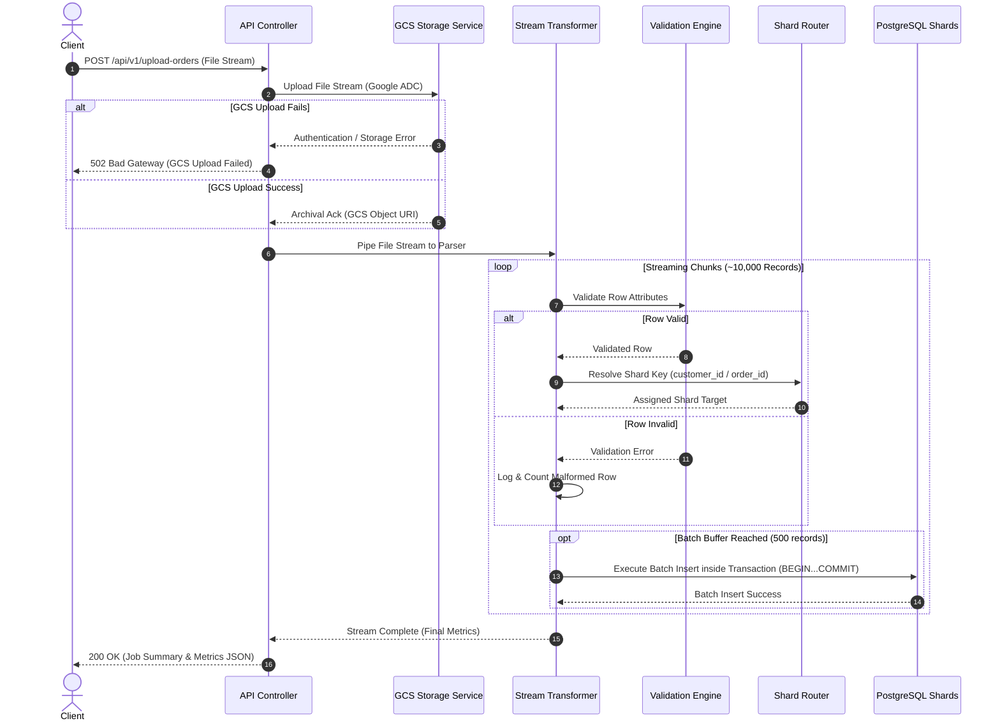

# API Design

## 1. API Overview

The purpose of this API Design document is to specify the RESTful HTTP web service interface for the **Backend Engineering Assessment** system. The API serves as the primary entry gateway for ingesting bulk order dataset files (~10,000 records in CSV or Excel format), archiving raw files in Google Cloud Storage (GCS) via Google Application Default Credentials (ADC), streaming data validation, and persisting order records into a sharded PostgreSQL database setup.

This specification defines endpoint paths, HTTP verbs, header contracts, multipart payload formats, JSON response schemas, HTTP status codes, error contracts, and API lifecycles. It is designed to be language-agnostic and implementation-independent.

---

## 2. API Standards

All API endpoints conform to standard enterprise RESTful conventions:

- **REST Protocol**: Standard HTTP verbs (`POST`, `GET`) mapping to domain resources (`/upload-orders`, `/orders`) `[Requirement]`.
- **Payload Format**: Multi-part form data (`multipart/form-data`) for file upload requests; JSON (`application/json`) for structured API responses and query responses `[Requirement]`.
- **HTTP Status Codes**: Standardized HTTP status codes indicating request success or specific error states `[Requirement]`.
- **API Versioning Strategy**: URI-based path versioning prefix (e.g., `/api/v1/upload-orders`) `[Recommendation]`.

---

## 3. Authentication Strategy

Based strictly on the assessment requirements:

- **GCP Cloud Service Authentication `[Requirement]`**: Authentication with Google Cloud Storage for archiving upload files relies on **Google Application Default Credentials (ADC)**. ADC resolves credentials automatically from the local environment (`gcloud auth application-default login`) or cloud execution environment (Workload Identity).
- **Zero Static Service Account Keys `[Requirement]`**: Absolute prohibition against hardcoding API keys or committing service account JSON credentials to source repositories.
- **Client API Access `[Assumption]`**: No specific client-side user authentication (e.g., OAuth2, JWT) is mandated by the assessment. Endpoints are exposed as public or internally secured HTTP routes.

---

## 4. Required APIs

### 4.1 `POST /upload-orders` `[Requirement]`

- **Purpose**: Primary endpoint accepting bulk order dataset files, triggering GCS upload, stream parsing, row validation, and sharded PostgreSQL batch persistence.
- **HTTP Method**: `POST`
- **Path**: `/api/v1/upload-orders`

#### Request Headers

| Header Name | Type | Required | Description |
| :--- | :--- | :--- | :--- |
| `Content-Type` | String | Yes | Must be `multipart/form-data` with boundary definition. |
| `Accept` | String | Yes | Should be `application/json`. |

#### Multipart Form-Data Request Payload

| Field Name | Type | Required | Description |
| :--- | :--- | :--- | :--- |
| `file` | Binary File Stream | Yes | Ingestion file in CSV (`.csv`) or Excel (`.xlsx`, `.xls`) format. |

#### Input Validation Rules
1. **File Presence**: Payload must contain a valid `file` stream. Missing file streams return HTTP 400.
2. **File Extension**: File extension must be `.csv`, `.xlsx`, or `.xls`. Invalid extensions return HTTP 400.
3. **Payload Stream Limit**: Maximum allowed payload size capped (e.g., 50MB) `[Recommendation]`.

#### End-to-End Processing Flow
1. Receive multipart file stream on `POST /upload-orders`.
2. Stream raw file payload to GCS bucket using Google ADC authentication.
3. Concurrently pipe file stream to stream reader and parser.
4. Validate each parsed row against mandatory schema fields (`order_id`, `customer_id`, `order_date`, `order_amount`, `status`).
5. Isolate, log, and count invalid/malformed rows.
6. Evaluate valid rows against the Shard Router to compute target PostgreSQL shard connections.
7. Buffer records into chunked batches (500–1000 rows) and execute transactional bulk inserts on target shards.
8. Aggregate execution statistics and return HTTP response.

#### Success Response Schema (`200 OK` / `202 Accepted`)

```json
{
  "status": "success",
  "message": "Orders file ingested successfully.",
  "data": {
    "jobId": "f47ac10b-58cc-4372-a567-0e02b2c3d479",
    "filename": "orders_10k.csv",
    "gcsUri": "gs://orders-bucket/2026/08/orders_10k_1723000000.csv",
    "metrics": {
      "totalRecords": 10000,
      "insertedRecords": 9950,
      "failedRecords": 50,
      "processingTimeMs": 3420
    }
  }
}
```

#### Error Response Breakdown

| Status Code | Reason Phrase | Trigger Condition |
| :--- | :--- | :--- |
| **`400 Bad Request`** | Invalid File Payload | File missing, invalid file format, or corrupted file header. |
| **`422 Unprocessable Entity`** | Data Validation Failure | Entire file contains unparseable or structurally invalid rows. |
| **`500 Internal Server Error`** | Ingestion Engine Error | Database shard offline, transaction failure, or unhandled system error. |
| **`502 Bad Gateway`** | GCS Cloud Archival Error | Google Cloud Storage API unreachable or ADC authorization failure. |

---

## 5. Optional (Bonus) APIs

### 5.1 `GET /orders/{orderId}` `[Bonus Requirement]`

- **Purpose**: Retrieve a single order record by its unique identifier.
- **HTTP Method**: `GET`
- **Path**: `/api/v1/orders/{orderId}`

#### Path Parameters

| Parameter | Type | Required | Description |
| :--- | :--- | :--- | :--- |
| `orderId` | String / UUID | Yes | Unique order identifier. |

#### Processing Flow
1. Receive request for `orderId`.
2. Evaluate Shard Router logic (if `orderId` is the shard key) to target the specific shard node. If non-shard key, execute scatter-gather query across all shards `[Recommendation]`.
3. Query database shard for order record.
4. Return `200 OK` with order JSON object or `404 Not Found` if record does not exist.

#### Success Response Schema (`200 OK`)

```json
{
  "status": "success",
  "data": {
    "orderId": "a1b2c3d4-e5f6-7890-abcd-ef1234567890",
    "customerId": "CUST-9921",
    "orderDate": "2026-08-06T14:30:00.000Z",
    "orderAmount": 149.99,
    "status": "COMPLETED"
  }
}
```

---

### 5.2 `GET /orders?customerId=` `[Bonus Requirement]`

- **Purpose**: Retrieve order history for a specific customer identifier.
- **HTTP Method**: `GET`
- **Path**: `/api/v1/orders?customerId={customerId}`

#### Query Parameters

| Parameter | Type | Required | Description |
| :--- | :--- | :--- | :--- |
| `customerId` | String | Yes | Customer reference identifier. |

#### Processing Flow
1. Receive request with `customerId` query parameter.
2. Shard Router calculates target shard using `customerId` shard key function.
3. Execute SQL query directly against the target shard database pool.
4. Return `200 OK` with JSON array of order records.

#### Success Response Schema (`200 OK`)

```json
{
  "status": "success",
  "data": {
    "customerId": "CUST-9921",
    "totalCount": 2,
    "orders": [
      {
        "orderId": "a1b2c3d4-e5f6-7890-abcd-ef1234567890",
        "orderDate": "2026-08-06T14:30:00.000Z",
        "orderAmount": 149.99,
        "status": "COMPLETED"
      },
      {
        "orderId": "f9e8d7c6-b5a4-3210-fedc-ba0987654321",
        "orderDate": "2026-08-05T09:15:00.000Z",
        "orderAmount": 89.50,
        "status": "PENDING"
      }
    ]
  }
}
```

---

### 5.3 `GET /health` `[Bonus Requirement]`

- **Purpose**: System health check monitoring database shard availability and GCS connectivity.
- **HTTP Method**: `GET`
- **Path**: `/health`

#### Success Response Schema (`200 OK`)

```json
{
  "status": "UP",
  "timestamp": "2026-08-06T22:00:00.000Z",
  "components": {
    "gcsStorage": "CONNECTED",
    "databaseShards": {
      "shard1": "UP",
      "shard2": "UP"
    }
  }
}
```

---

## 6. Request Validation Rules

Incoming file stream rows must satisfy strict field validation rules before database ingestion:

| Field Name | Data Type Constraint | Mandatory | Field Validation Rule |
| :--- | :--- | :--- | :--- |
| `order_id` | String / UUID | Yes | Non-empty string; valid UUID or string representation. |
| `customer_id` | String | Yes | Non-empty string identifier. |
| `order_date` | Timestamp | Yes | Valid ISO-8601 formatted timestamp string. |
| `order_amount` | Decimal | Yes | Numeric decimal value greater than 0.00 (`order_amount > 0`). |
| `status` | String | Yes | Valid status string (e.g., `PENDING`, `COMPLETED`, `CANCELLED`). |

---

## 7. Response Standard

All JSON responses follow a consistent, standardized envelope format:

### Success Envelope Format `[Recommendation]`

```json
{
  "status": "success",
  "message": "Optional descriptive summary text",
  "data": {}
}
```

### Error Envelope Format `[Recommendation]`

```json
{
  "status": "error",
  "code": "ERROR_CATEGORY_CODE",
  "message": "Human-readable error description",
  "details": []
}
```

---

## 8. Error Response Format

Detailed error response examples returned by the API layer:

### 8.1 Invalid File Format (`400 Bad Request`)

```json
{
  "status": "error",
  "code": "INVALID_FILE_TYPE",
  "message": "Only CSV and Excel (.xlsx, .xls) file formats are supported.",
  "details": [
    {
      "field": "file",
      "issue": "Uploaded file extension '.pdf' is invalid."
    }
  ]
}
```

### 8.2 Google Cloud Storage Failure (`502 Bad Gateway`)

```json
{
  "status": "error",
  "code": "GCS_UPLOAD_FAILED",
  "message": "Failed to archive raw upload file to Google Cloud Storage.",
  "details": [
    {
      "component": "GoogleCloudStorage",
      "issue": "Application Default Credentials (ADC) token invalid or bucket unreachable."
    }
  ]
}
```

---

## 9. Processing States

During bulk ingestion, an import job transitions through distinct operational processing states:

```
[ RECEIVED ] ---> [ ARCHIVING_GCS ] ---> [ STREAM_PARSING ] ---> [ VALIDATING ] ---> [ PERSISTING_SHARDS ] ---> [ COMPLETED ]
                                                                      |
                                                                      +---> [ FAILED ] (Fatal Error)
```

1. **`RECEIVED`**: HTTP request payload received by endpoint controller.
2. **`ARCHIVING_GCS`**: Raw file stream piped to Google Cloud Storage via ADC.
3. **`STREAM_PARSING`**: File stream opened by CSV/Excel streaming reader.
4. **`VALIDATING`**: Row attributes checked by Validation Engine.
5. **`PERSISTING_SHARDS`**: Chunked record batches written to sharded PostgreSQL databases via transactions.
6. **`COMPLETED`**: Stream complete; execution summary returned to client.
7. **`FAILED`**: Fatal system or storage error aborting job processing.

---

## 10. API Sequence Diagram

The complete API execution lifecycle for `POST /upload-orders`:



---

## 11. API Lifecycle

1. **Request Reception**: API transport layer validates incoming headers and extracts multipart file stream.
2. **Authentication Check**: Verifies GCP ADC context for storage operations.
3. **Cloud Storage Handshake**: Opens streaming upload channel to target GCS bucket.
4. **Stream Processing**: Reads file chunks, parses row objects, validates attributes, and computes shard destinations.
5. **Transactional Persistence**: Flushes memory-bounded batches to PostgreSQL shards wrapped in SQL transactions.
6. **Metric Aggregation**: Computes overall ingestion stats (total, inserted, skipped, duration).
7. **Response Delivery**: Returns final JSON response payload and closes HTTP connection.

---

## 12. Rate Limiting Recommendations `[Recommendation]`

- **Ingestion Endpoint (`POST /upload-orders`)**: Rate limit client requests (e.g., 5 requests per minute per IP address) to prevent API denial-of-service (DoS) via simultaneous bulk file uploads.
- **Query Endpoints (`GET /orders`)**: Standard rate limiting (e.g., 100 requests per minute) to protect database shards from query spamming.

---

## 13. Security Considerations

- **Keyless Cloud Auth (ADC)**: Mandatory reliance on Google Application Default Credentials prevents static credential leaks `[Requirement]`.
- **Payload Stream Limits**: Enforce strict maximum upload size limits (e.g., 50MB) to prevent memory exhaustion attacks `[Recommendation]`.
- **SQL Parameterization**: All query executions must use parameterized queries to prevent SQL injection vulnerabilities `[Requirement]`.

---

## 14. Logging Expectations `[Requirement]`

- **Upload Lifecycle Logs**: Log upload request start, file name, payload byte size, GCS bucket target, and completion timestamps.
- **Processing Status Logs**: Log incremental ingestion metrics (e.g., "Processed 5,000 / 10,000 rows").
- **Failed Records Logs**: Log granular row-level validation errors (line number, raw value, error reason) for skipped rows.

---

## 15. API Versioning

- **URI Versioning Prefix**: All endpoints include `/api/v1/` prefix path to support future API revisions without breaking backward compatibility `[Recommendation]`.

---

## 16. Future APIs `[Recommendation]`

- **`GET /api/v1/jobs/{jobId}`**: Endpoint querying progress status and metrics for async background ingestion jobs.
- **`GET /api/v1/jobs/{jobId}/errors`**: Endpoint fetching paginated dead-letter records (`failed_records`) for auditing.

---

## 17. Risks

1. **Upload Timeout Risk**: Large files processed synchronously over slow networks may exceed standard HTTP client timeouts.
2. **GCS API Unavailable Risk**: GCS API downtime aborting file uploads.
3. **Scatter-Gather Latency Risk**: `GET /orders/{orderId}` executing queries across all database shards if the shard key is based on `customer_id`.

---

## 18. Recommendations

1. **Standardize API Envelopes**: Enforce strict `{ status, message, data }` JSON response structures across all endpoints `[Recommendation]`.
2. **Return Granular Execution Summaries**: Provide total, inserted, and failed record metrics in `POST /upload-orders` responses `[Recommendation]`.
3. **Target Single Shards in Query APIs**: Ensure query parameter endpoints (`GET /orders?customerId=`) filter directly on shard key attributes to target discrete database instances `[Recommendation]`.

---

## 19. Summary

The **API Design** establishes a robust RESTful specification for the Backend Engineering Assessment. By decoupling file upload, cloud storage archival (via Google ADC), stream parsing, row validation, and sharded PostgreSQL batch persistence, the API delivers a high-throughput, secure, and resilient bulk data ingestion interface.
