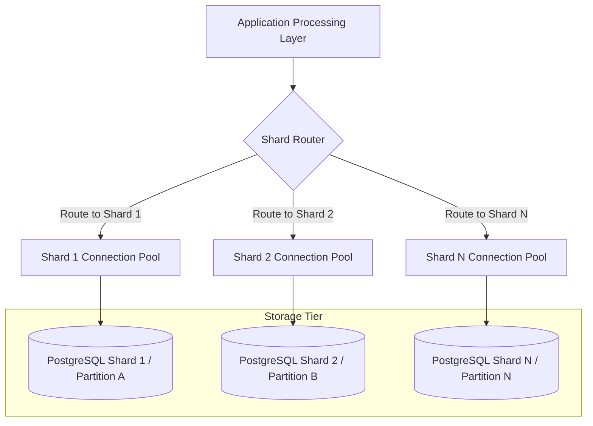
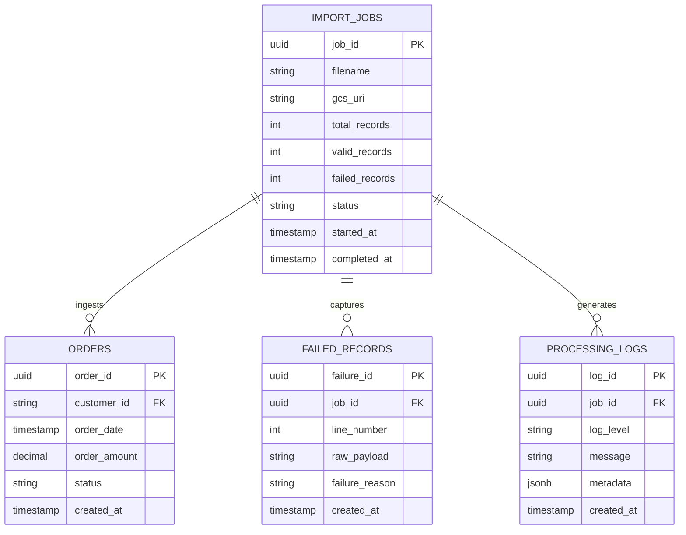
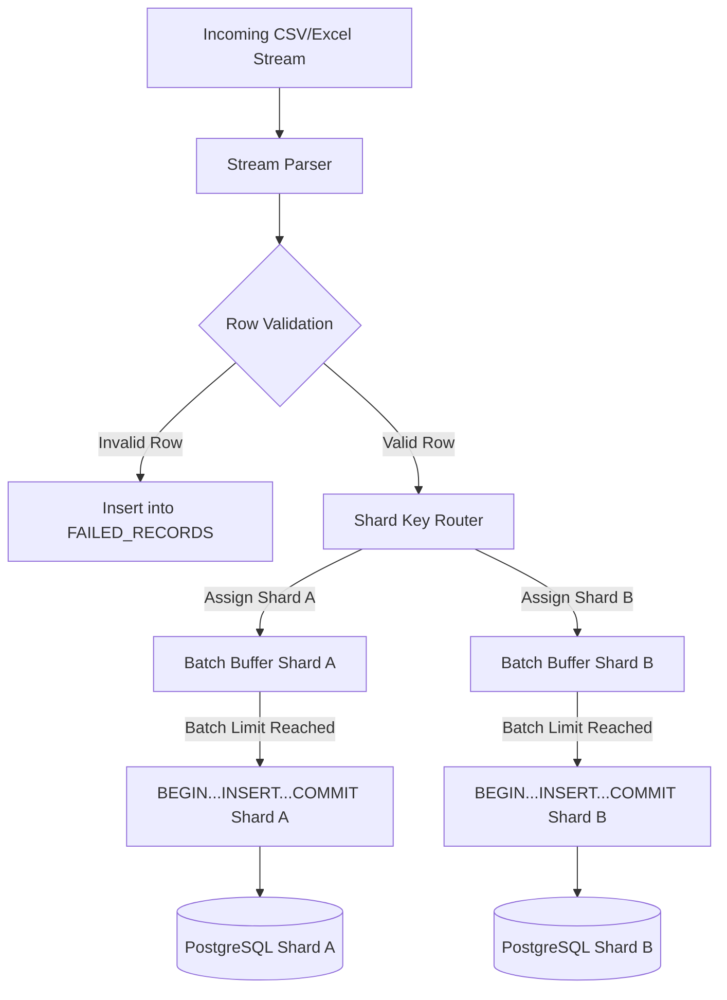

# Database Design

## 1. Purpose

The purpose of this Database Design document is to specify the architectural topology, schema strategy, sharding design, and data persistence models for the **Backend Engineering Assessment** system. The database architecture is engineered to ingest, validate, and store bulk order datasets (~10,000 records per upload file) with high throughput, transactional integrity, and horizontal scalability in PostgreSQL.

This document serves as an architectural blueprint for database administrators, backend engineers, and system architects. It establishes the physical and logical database design principles required to prevent database write bottlenecks, index bloat, and lock contention during high-volume streaming ingestions.

---

## 2. Database Goals

The database design is guided by four fundamental architectural goals:

- **Scalability**: Support horizontal write scaling across multiple database nodes or table partitions using a sharded architecture to handle continuous bulk dataset growth beyond single-node boundaries `[Requirement]`.
- **Performance**: Maximize write throughput for ~10,000-record import payloads by leveraging multi-row batch inserts and parameterized SQL execution while minimizing network round-trips `[Requirement]`.
- **Reliability**: Ensure data atomicity and consistency through explicit database transactions (`BEGIN` ... `COMMIT` / `ROLLBACK`), preventing corrupt or partial data states during ingestion failures `[Requirement]`.
- **Data Integrity**: Enforce strict data types, field nullability rules, domain constraints, and primary key uniqueness across physical and logical shards `[Requirement]`.

---

## 3. Database Architecture Overview

The database architecture employs a sharded PostgreSQL persistence model designed to decouple write traffic across logical partitions or discrete database instances. Incoming stream payloads from the application layer are validated, grouped into multi-row batches, evaluated against a deterministic shard key, and executed as transactional batch inserts on target database shards.

### Database Architecture Topology



---

## 4. Entity Identification

Based on the assessment requirements and production backend engineering best practices, four primary entities are identified:

### 4.1 Core Domain Entities

1. **Orders Entity `[Requirement]`**:
   - Primary domain entity representing customer transaction records ingested from the bulk orders file.
   - Core fields mandated by assessment: `order_id`, `customer_id`, `order_date`, `order_amount`, `status`.

2. **Import Jobs Entity `[Recommendation]`**:
   - Operational entity tracking bulk file upload ingestion lifecycles (e.g., source filename, GCS object URI, total records, status, timing metrics).

3. **Failed Records Entity `[Recommendation]`**:
   - Audit/Dead-Letter entity storing malformed or invalid order rows isolated during file streaming and validation.

4. **Processing Logs Entity `[Recommendation]`**:
   - System observability entity recording batch execution milestones, performance metrics, and database operational errors.

---

## 5. Logical Data Model

The logical data model defines the structural entities, attributes, and relationships governing order storage and ingestion auditing.

### Entity-Relationship Diagram (ERD)



---

## 6. Recommended Table Structure

This section outlines the physical schema definitions for all core and auditing tables.

### 6.1 `orders` Table `[Requirement]`
- **Purpose**: Persists validated order transactions distributed across database shards.
- **Key Columns**:
  - `order_id` (UUID / VARCHAR, Primary Key): Unique order identifier.
  - `customer_id` (VARCHAR, Shard Key Candidate): Customer reference identifier.
  - `order_date` (TIMESTAMPTZ): Transaction timestamp.
  - `order_amount` (NUMERIC(12, 2)): Monetary transaction value.
  - `status` (VARCHAR(50)): Current order status (e.g., `PENDING`, `COMPLETED`, `CANCELLED`).
  - `created_at` (TIMESTAMPTZ): Ingestion timestamp `[Recommendation]`.
- **Relationships**: Belongs to an optional `import_jobs` record via `job_id` reference `[Recommendation]`.
- **Index Requirements**: Primary key index on `order_id`; secondary composite index on `(customer_id, order_date)`.

### 6.2 `import_jobs` Table `[Recommendation]`
- **Purpose**: Tracks file upload metadata, GCS storage paths, and overall processing lifecycle states.
- **Key Columns**: `job_id` (PK), `filename`, `gcs_uri`, `total_records`, `valid_records`, `failed_records`, `status`, `started_at`, `completed_at`.
- **Relationships**: One-to-Many with `failed_records` and `processing_logs`.
- **Index Requirements**: Primary key on `job_id`; secondary index on `status`.

### 6.3 `failed_records` Table `[Recommendation]`
- **Purpose**: Dead-letter storage for malformed CSV/Excel rows skipped during file validation.
- **Key Columns**: `failure_id` (PK), `job_id` (FK), `line_number`, `raw_payload`, `failure_reason`, `created_at`.
- **Relationships**: Many-to-One with `import_jobs`.
- **Index Requirements**: Primary key on `failure_id`; index on `job_id`.

### 6.4 `processing_logs` Table `[Recommendation]`
- **Purpose**: Operational event log capturing batch milestones, ingestion timers, and database errors.
- **Key Columns**: `log_id` (PK), `job_id` (FK), `log_level`, `message`, `metadata` (JSONB), `created_at`.
- **Relationships**: Many-to-One with `import_jobs`.
- **Index Requirements**: Primary key on `log_id`; index on `(job_id, log_level)`.

---

## 7. Data Types Strategy

Choosing appropriate data types is critical for optimizing disk storage, memory alignment, and query performance in PostgreSQL:

- **Identifiers (`order_id`, `customer_id`)**:
  - `order_id`: `UUID` or `VARCHAR(64)` `[Requirement]`. Using `UUID` provides native 128-bit storage efficiency and global uniqueness across shards.
  - `customer_id`: `VARCHAR(64)` `[Requirement]` to support alphanumeric customer identifiers.
- **Timestamps (`order_date`)**:
  - `TIMESTAMPTZ` (Timestamp with Time Zone) `[Requirement]` ensures unambiguous UTC time storage and timezone conversion safety.
- **Monetary Amounts (`order_amount`)**:
  - `NUMERIC(12, 2)` or `DECIMAL(12, 2)` `[Requirement]` guarantees exact fixed-point precision, preventing floating-point rounding errors inherent in `FLOAT` or `DOUBLE PRECISION`.
- **Statuses (`status`)**:
  - `VARCHAR(50)` `[Requirement]` or standard PostgreSQL enumerated type (`ENUM`) `[Recommendation]` for restricted state values.

---

## 8. Primary Keys

- **Global Uniqueness**: Primary keys must remain unique across all physical database shards. Standard auto-incrementing sequences (`BIGSERIAL`) risk ID collision across independent database nodes unless offset ranges are configured.
- **`UUID` Primary Keys `[Recommendation]`**: Utilizing UUIDs (v4 random or v7 time-ordered) guarantees global uniqueness across all shards without inter-node coordination or sequence synchronization overhead.
- **Composite Primary Keys**: If PostgreSQL native table partitioning is used, composite primary keys incorporating the partition/shard key (e.g., `PRIMARY KEY (order_id, customer_id)`) are required by PostgreSQL partitioning syntax `[Requirement]`.

---

## 9. Foreign Keys

- **Single-Shard Foreign Keys**: Foreign keys between `import_jobs`, `failed_records`, and `processing_logs` can be strictly enforced when stored within the same central or local database instance `[Recommendation]`.
- **Cross-Shard Foreign Key Limitations**: In a distributed multi-database sharded architecture, cross-database foreign key constraints cannot be natively enforced by PostgreSQL engines. The application layer or shard router assumes responsibility for maintaining reference integrity across discrete shard databases `[Requirement]`.

---

## 10. Indexing Strategy

Indexes must be strategically designed to accelerate query performance without degrading write throughput during bulk ingestion.

### 10.1 Primary & Shard Key Indexes
- **`PRIMARY KEY (order_id)`**: Automatically creates a unique B-Tree index, supporting fast point lookups for optional `GET /orders/:orderId` endpoint `[Requirement]`.
- **`INDEX idx_orders_customer_id ON orders (customer_id)`**: B-Tree index optimizing customer query lookups for optional `GET /orders?customerId=` endpoint `[Requirement]`.

### 10.2 Composite Indexes `[Recommendation]`
- **`INDEX idx_orders_customer_date ON orders (customer_id, order_date DESC)`**: Accelerates customer order history queries filtered or ordered by timestamp.

### 10.3 Write-Overhead Mitigation
- Index updates impose overhead during bulk `INSERT` operations. Indexes must be restricted strictly to essential query paths (`order_id` and `customer_id`) to maintain high bulk ingestion rates.

---

## 11. Query Optimization Strategy

To satisfy API performance expectations for read and write queries:

- **Targeted Shard Routing**: Queries filtering by `customer_id` are routed directly to the specific shard storing that customer's data, bypassing non-relevant database instances (`[Requirement]`).
- **Scatter-Gather Queries**: Queries targeting non-shard keys (e.g., fetching by `order_id` in a `customer_id`-sharded setup) require parallel execution across all shards, aggregated by the application layer `[Recommendation]`.
- **Parameterized SQL**: All dynamic SQL queries must use parameterized placeholders (`$1, $2, ...`) to enable PostgreSQL query plan caching and eliminate SQL injection risks `[Requirement]`.

---

## 12. Batch Insert Strategy

Single-row `INSERT` statements executed in loops generate high network latency and transaction overhead. The database design requires chunked multi-row batch inserts:

```
Multi-Row SQL Pattern Example:
INSERT INTO orders (order_id, customer_id, order_date, order_amount, status)
VALUES 
  ($1, $2, $3, $4, $5),
  ($6, $7, $8, $9, $10),
  ...
  ($N1, $N2, $N3, $N4, $N5);
```

- **Optimal Batch Size**: Grouping records into batches of **500 to 1,000 records** strikes an optimal balance between minimizing network round-trips and avoiding SQL statement buffer limits `[Recommendation]`.
- **Throughput Gains**: Batch inserts increase ingestion throughput by **10x to 50x** compared to single-row loop execution `[Requirement]`.

---

## 13. Transaction Strategy

Database operations during bulk ingestion must be executed within explicit SQL transaction boundaries to guarantee ACID compliance:

```
Transaction Boundary Workflow:
BEGIN;
  INSERT INTO orders VALUES (...) [Batch Chunk 1];
  INSERT INTO orders VALUES (...) [Batch Chunk 2];
COMMIT;
```

- **Atomicity per Batch**: Wrapping each batch chunk within `BEGIN` and `COMMIT` ensures that if a database error occurs (e.g., connection drop or disk error), an immediate `ROLLBACK` reverts the entire batch without leaving partial or corrupted states `[Requirement]`.
- **Isolation Level**: Standard `READ COMMITTED` isolation level provides optimal performance while preventing dirty reads during batch insertions `[Recommendation]`.

---

## 14. Sharding Design

### 14.1 Why Sharding is Required
A single monolithic PostgreSQL table handling millions of orders eventually encounters disk I/O limits, CPU bottlenecking, and slow index maintenance. Sharding divides data horizontally across independent physical or logical tables, unlocking linear scaling `[Requirement]`.

### 14.2 Candidate Shard Keys (Listed in Assessment)

1. **`customer_id` Shard Key**:
   - *Logic*: Routes orders based on customer identifier (e.g., `hash(customer_id) % N`).
   - *Pros*: Co-locates all orders for a single customer on the same shard; highly optimal for `GET /orders?customerId=`.
   - *Cons*: Risk of data skew if specific customers generate disproportionately large order volumes (hotspotting).

2. **Hash of `order_id` Shard Key**:
   - *Logic*: Computes a modulo hash on `order_id` (e.g., `md5(order_id) % N`).
   - *Pros*: Guarantees uniform, balanced data distribution across all shards.
   - *Cons*: `GET /orders?customerId=` queries become scatter-gather operations across all shards.

3. **Time-Based Sharding (`order_date`)**:
   - *Logic*: Partitions orders into time windows (e.g., monthly/yearly tables).
   - *Pros*: Simplifies historical data archiving and partition drop strategies.
   - *Cons*: Recent time partitions receive 100% of write traffic, creating write hotspots.

### 14.3 Shard Routing Responsibilities
- The application Shard Router evaluates the chosen shard key for each record/batch and resolves the target connection pool or partition `[Requirement]`.
- Routing rules must remain deterministic to ensure records are always written to and queried from the correct shard.

---

## 15. Partitioning vs. Sharding Comparison

| Feature | PostgreSQL Table Partitioning | Application-Level Sharding |
| :--- | :--- | :--- |
| **Execution Tier** | Managed natively inside a single PostgreSQL database instance. | Managed by application logic across multiple database instances. |
| **Physical Nodes** | Single physical database server (shared CPU/RAM/Disk). | Multiple distinct physical database servers (independent CPU/RAM/Disk). |
| **Setup Complexity** | Low (declarative `CREATE TABLE ... PARTITION BY`). | Medium/High (requires multi-pool router in Node.js). |
| **Scaling Limit** | Limited by single-node hardware capabilities. | Scalable horizontally across unlimited database hardware nodes. |
| **Cross-Partition Queries** | Native SQL support via parent table queries. | Application scatter-gather aggregation required. |
| **Assessment Status** | Acceptable approach `[Requirement]`. | Recommended approach `[Requirement]`. |

---

## 16. Data Flow into Database

The data flow from incoming stream payload to sharded database storage follows a structured pipeline.

### Data Flow Pipeline Diagram



---

## 17. Error Record Storage Strategy

When malformed or invalid dataset rows are detected during streaming ingestion:

1. **Isolation Boundary**: Invalid rows are immediately extracted from the stream pipeline without halting parsing for valid rows `[Requirement]`.
2. **Dead-Letter Storage `[Recommendation]`**: Malformed records are transformed into `failed_records` rows capturing `job_id`, row line number, raw payload string, and specific validation failure message.
3. **Audit Trail**: Storing failed records in a dead-letter table enables developers and business users to audit ingestion file quality and re-process rejected records.

---

## 18. Data Validation Rules

The database schema and application validation engine enforce strict constraints on all order attributes:

| Field Name | Type Constraint | Validation Rules | DB Constraint |
| :--- | :--- | :--- | :--- |
| `order_id` | String / UUID | Must be non-null; valid UUID/String format. | `PRIMARY KEY`, `NOT NULL` |
| `customer_id` | String | Must be non-null; non-empty string. | `NOT NULL` |
| `order_date` | Timestamp | Must be non-null; valid ISO-8601 timestamp. | `NOT NULL` |
| `order_amount` | Decimal | Must be non-null; positive decimal value ($> 0.00$). | `NOT NULL`, `CHECK (order_amount >= 0)` |
| `status` | String | Must be non-null; valid status string. | `NOT NULL` |

---

## 19. Scalability Considerations

- **Horizontal Node Additions**: The sharding layout allows introducing new PostgreSQL database instances as order volumes grow.
- **Connection Pool Tuning**: Each application instance must maintain bounded connection pools (e.g., 10–20 connections per shard) to prevent PostgreSQL connection exhaustion (`max_connections`) `[Recommendation]`.
- **Indexing Balance**: Avoid over-indexing; every additional index slows bulk write throughput during ingestion.

---

## 20. Future Database Expansion

The database architecture supports seamless future expansions:

- **Read Replicas**: Primary database shards handle bulk write ingestion while read replicas handle analytics and reporting queries `[Recommendation]`.
- **Archival Partitioning**: Time-based partitioning strategies can be combined with application sharding to move historical orders to cold object storage after retention thresholds expire `[Recommendation]`.

---

## 21. Backup & Recovery Considerations

- **Shard-Level Point-in-Time Recovery (PITR)**: Enable PostgreSQL Write-Ahead Logging (WAL) archiving on all shard databases to allow independent point-in-time recovery `[Recommendation]`.
- **Raw Cloud File Retention**: Raw orders files stored in Google Cloud Storage serve as an immutable, durable backup, enabling complete database re-ingestion if a database shard suffers catastrophic loss `[Requirement]`.

---

## 22. Risks

Database architectural risks and mitigation strategies:

1. **Data Skew / Hotspotting Risk**:
   - *Risk*: Uneven shard key distribution overloading a single database node.
   - *Mitigation*: Utilize a modulo hash algorithm on `order_id` or implement uniform customer hash routing.
2. **Connection Exhaustion Risk**:
   - *Risk*: Multiple application instances exhausting PostgreSQL connection limits across shards.
   - *Mitigation*: Implement connection pooling (e.g., `pg.Pool` or PgBouncer) with strict pool size limits.
3. **Cross-Shard Query Latency Risk**:
   - *Risk*: Queries spanning multiple shards requiring slow scatter-gather execution.
   - *Mitigation*: Enforce shard key filters on query endpoints (`GET /orders?customerId=`) to target single shards directly.

---

## 23. Recommendations

1. **Adopt Application-Level Sharding with Hashed Shard Keys**: Use a modulo hash on `order_id` or `customer_id` to guarantee uniform write distribution across PostgreSQL nodes `[Recommendation]`.
2. **Use UUID v4 / v7 Primary Keys**: Standardize on UUIDs to guarantee global primary key uniqueness across distributed database shards `[Recommendation]`.
3. **Execute Multi-Row Batch Inserts (500–1000 Rows)**: Wrap chunked bulk inserts in SQL transactions to maximize ingestion throughput `[Recommendation]`.
4. **Maintain a Dead-Letter Table (`failed_records`)**: Persist malformed row payloads alongside error reasons for auditing and retry capabilities `[Recommendation]`.

---

## 24. Summary

The **Database Design** establishes a high-performance, horizontally scalable relational persistence architecture for the Backend Engineering Assessment. By combining streaming batch ingestion, transactional integrity boundaries, strategic indexing, and application-level PostgreSQL sharding, the design guarantees that 10,000-record order files are ingested rapidly and persisted reliably without single-node bottlenecks or system degradation.
