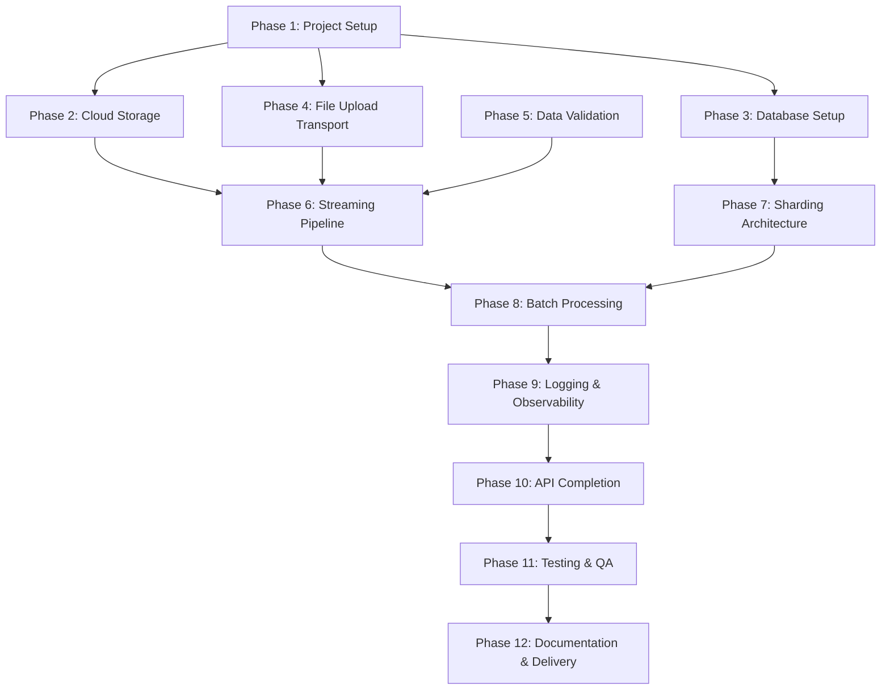

# Development Plan

## 1. Project Objectives

The objective of this Development Plan is to establish an execution roadmap for building the **Backend Engineering Assessment** system within a 24-hour development window `[Requirement]`.

The project delivers a high-throughput, memory-efficient Node.js backend capable of ingesting bulk order datasets (~10,000 records), archiving raw files in Google Cloud Storage (GCS) using Application Default Credentials (ADC), streaming row validation, and persisting orders into a sharded PostgreSQL database environment using transactional batch execution.

---

## 2. Development Principles

1. **Strict 24-Hour Time Management**: Prioritize mandatory core functional requirements first, followed by bonus features if time permits `[Requirement]`.
2. **Zero Hardcoded Credentials**: Strictly utilize Google Application Default Credentials (ADC) for cloud authentication without static service account keys `[Requirement]`.
3. **Low Memory Footprint**: Enforce stream processing to prevent full-file RAM buffering during ingestion `[Requirement]`.
4. **Transactional Data Safety**: Wrap database batch insertions inside explicit SQL transactions to ensure data atomicity `[Requirement]`.
5. **Clean Architecture & Separation of Concerns**: Maintain modular boundaries between transport controllers, stream transformers, validation logic, shard routers, and database adapters `[Requirement]`.

---

## 3. Milestones

The implementation roadmap is broken down into 12 phases structured to meet the 24-hour execution constraint:

### Phase 1: Project Setup (Hours 0.0 – 1.5) `[Requirement]`
- Initialize Git repository and Node.js project structure.
- Configure dependency manifests, code formatting, and environment configuration templates (`.env.example`).
- Setup local development script scripts and environment variables.

### Phase 2: Cloud Storage Integration (Hours 1.5 – 3.5) `[Requirement]`
- Configure local Google Application Default Credentials (ADC) via `gcloud auth application-default login`.
- Integrate Google Cloud Storage (GCS) SDK adapter.
- Implement streaming file upload module targeting designated GCS bucket.

### Phase 3: Database Schema & Migration Setup (Hours 3.5 – 6.0) `[Requirement]`
- Design PostgreSQL schema for core `orders` table and optional auditing tables (`import_jobs`, `failed_records`).
- Create SQL migration DDL scripts and primary key/indexing structures.
- Setup local multi-shard PostgreSQL database connection pools.

### Phase 4: File Upload Transport Layer (Hours 6.0 – 8.0) `[Requirement]`
- Implement HTTP server routing infrastructure.
- Setup multipart file upload intake middleware on `POST /upload-orders`.
- Enforce file extension validation (.csv, .xlsx, .xls) and upload payload size limits.

### Phase 5: Data Validation Engine (Hours 8.0 – 10.0) `[Requirement]`
- Build Validation Engine verifying required attributes (`order_id`, `customer_id`, `order_date`, `order_amount`, `status`).
- Implement row-level type enforcement and domain rules ($order\_amount > 0$).
- Construct fault-isolated error handling to skip and log malformed rows without crashing process streams.

### Phase 6: Streaming Parsing Pipeline (Hours 10.0 – 12.0) `[Requirement]`
- Integrate memory-conscious CSV/Excel stream parsers (`csv-parser` / `exceljs`).
- Connect stream transformers to validate rows on-the-fly with backpressure control.
- Guarantee constant RAM consumption (< 50MB) during ~10,000-record ingestion.

### Phase 7: Sharding Architecture & Routing (Hours 12.0 – 14.5) `[Requirement]`
- Implement application-level Shard Router evaluating chosen shard key (`customer_id`, hash of `order_id`, or `order_date`).
- Establish connection pool management across target PostgreSQL shards.
- Validate deterministic record routing to target shard instances.

### Phase 8: Transactional Batch Processing (Hours 14.5 – 17.0) `[Requirement]`
- Implement Batch Insert Service grouping validated rows into 500–1000 record chunks.
- Construct multi-row parameterized SQL bulk insert statement generator.
- Wrap batch insertions inside explicit SQL transaction blocks (`BEGIN` ... `COMMIT` / `ROLLBACK`).

### Phase 9: Structured Logging & Observability (Hours 17.0 – 18.5) `[Requirement]`
- Integrate structured JSON logger (Pino / Winston) `[Recommendation]`.
- Implement log events for upload start/completion, batch ingestion metrics, and malformed row errors.
- Optionally add `/health` status endpoint `[Bonus Requirement]`.

### Phase 10: API Endpoints Completion (Hours 18.5 – 20.5) `[Requirement]`
- Finalize `POST /upload-orders` response formatting and metrics summary payload.
- Implement optional bonus query endpoints (`GET /orders/:orderId`, `GET /orders?customerId=`) `[Bonus Requirement]`.

### Phase 11: Testing & Quality Assurance (Hours 20.5 – 22.5) `[Recommendation]`
- Execute ingestion pipeline tests using sample 10,000-record CSV/Excel files.
- Verify GCS cloud storage archival and database shard distribution.
- Run unit/integration tests covering stream validation and shard routing `[Bonus Requirement]`.

### Phase 12: Documentation & Finalization (Hours 22.5 – 24.0) `[Requirement]`
- Write comprehensive `README.md` detailing setup instructions, ADC configuration, sharding strategy rationale, and architectural trade-offs.
- Verify final submission package: Git source code, `README.md`, SQL migrations, and `.env.example`.

---

## 4. Deliverables

| # | Deliverable Asset | Assessment Mandate | Description |
| :--- | :--- | :--- | :--- |
| **D1** | **Source Code Repository** | Mandatory `[Requirement]` | Clean Git repository containing modular Node.js backend application code. |
| **D2** | **`README.md` Documentation** | Mandatory `[Requirement]` | Setup & run guide, ADC configuration instructions, sharding rationale, trade-off analysis. |
| **D3** | **SQL Migration Scripts** | Mandatory `[Requirement]` | DDL scripts creating tables, indexes, and partition structures for PostgreSQL shards. |
| **D4** | **`.env.example` Template** | Mandatory `[Requirement]` | Configuration template detailing environment variables without static secrets. |
| **D5** | **Dockerized Setup** | Bonus `[Bonus Requirement]` | `Dockerfile` and `docker-compose.yml` for multi-shard PostgreSQL execution `[Recommendation]`. |
| **D6** | **Automated Tests** | Bonus `[Bonus Requirement]` | Unit and integration test suite verifying validators and shard routing `[Recommendation]`. |

---

## 5. Dependency Graph

The technical phase dependencies governing project execution:

---

## 6. Task Priorities

Task priorities are categorized into Critical Path (Must Have) and Bonus Enhancements (Nice to Have):

### Critical Path (Priority 1 - Must Have) `[Requirement]`
- Project initialization and `.env.example` creation.
- GCS upload integration using Google Application Default Credentials (ADC).
- Streaming file reader and parser for CSV/Excel datasets (~10,000 records).
- Row validation engine evaluating required order fields (`order_id`, `customer_id`, `order_date`, `order_amount`, `status`).
- Application-level Shard Router and multi-shard PostgreSQL database connections.
- Transactional batch SQL insert execution.
- Mandatory API endpoint `POST /upload-orders`.
- Comprehensive `README.md` documentation and SQL migration DDLs.

### Bonus Enhancements (Priority 2 - Nice to Have) `[Bonus Requirement]`
- Optional query endpoints: `GET /orders/:orderId` and `GET /orders?customerId=`.
- System health check endpoint `GET /health`.
- Dockerized local environment (`docker-compose.yml`) for multi-shard testing.
- Automated unit/integration test suite.
- Asynchronous background worker queue (BullMQ / RabbitMQ).

---

## 7. Risk Analysis

| Risk Description | Probability | Impact | Mitigation Strategy |
| :--- | :--- | :--- | :--- |
| **ADC Authentication Failures** | Medium | High | Verify local `gcloud auth application-default login` context early in Phase 2. |
| **High Memory RAM Spikes** | High | Critical | Enforce stream piping and avoid non-streaming synchronous file reading library calls. |
| **Shard Data Skew / Hotspotting** | Medium | High | Utilize uniform modulo hashing on `order_id` or `customer_id` in Shard Router. |
| **24-Hour Time Overrun** | High | High | Strictly implement Priority 1 core features before working on optional bonus items. |
| **Transaction Deadlocks / Timeouts** | Low | Medium | Restrict batch sizes to 500–1000 records and enforce query parameterization. |

---

## 8. Development Timeline

The 24-hour development timeline organized as a Gantt chart:

```mermaid
gantt
    title Backend Assessment 24-Hour Development Timeline
    dateFormat  X
    axisFormat Hour %H
    
    section Setup & Infra
    Phase 1: Project Setup              :p1, 0, 2
    Phase 2: Cloud Storage (ADC)        :p2, 1, 4
    Phase 3: Database & Migrations      :p3, 3, 6

    section Core Pipeline
    Phase 4: File Upload API            :p4, 6, 8
    Phase 5: Validation Engine          :p5, 8, 10
    Phase 6: Streaming Pipeline         :p6, 10, 12
    Phase 7: Sharding & Routing         :p7, 12, 15

    section Persistence & API
    Phase 8: Transactional Batch Inserts:p8, 14, 17
    Phase 9: Logging & Metrics          :p9, 17, 19
    Phase 10: API Finalization & Bonus  :p10, 18, 21

    section Testing & Docs
    Phase 11: Testing & QA              :p11, 20, 23
    Phase 12: README & Finalizing       :p12, 22, 24
```

---

## 9. Acceptance Criteria

The final submission must satisfy the following explicit acceptance criteria:

1. **Ingestion Capability `[Requirement]`**: `POST /upload-orders` successfully ingests a 10,000-record CSV or Excel dataset without crashing or throwing out-of-memory errors.
2. **Cloud Storage Archival `[Requirement]`**: Uploaded raw orders file is stored in a GCS bucket using Google ADC authentication without any committed service account keys.
3. **Data Integrity `[Requirement]`**: Valid records are inserted into PostgreSQL; malformed rows are isolated, logged, and skipped without process termination.
4. **Sharding Verification `[Requirement]`**: Orders are distributed across PostgreSQL database shards according to the documented shard key routing strategy.
5. **Transactional Integrity `[Requirement]`**: Batch inserts are executed within SQL transactions, ensuring atomic batch writes.
6. **Documentation Completeness `[Requirement]`**: Git repository contains functional source code, SQL migration scripts, `.env.example`, and a detailed `README.md`.

---

## 10. Final Checklist

Before final project submission, verify every checklist item:

- [ ] Node.js application executes cleanly without unhandled runtime exceptions.
- [ ] Raw file stream successfully uploads to GCS using `gcloud` ADC authentication.
- [ ] Zero static service account keys or plaintext secrets exist in code or repository.
- [ ] Streaming file reader processes ~10,000 rows under low constant memory usage (< 50MB RAM).
- [ ] Row validator isolates and logs invalid rows while allowing valid rows to proceed.
- [ ] Shard router correctly distributes rows across target PostgreSQL database shards.
- [ ] Multi-row batch inserts execute inside explicit SQL transactions (`BEGIN` ... `COMMIT`).
- [ ] Endpoint `POST /upload-orders` returns accurate execution metrics JSON.
- [ ] SQL schema DDL / migration scripts are included and reproducible.
- [ ] Template `.env.example` file is included.
- [ ] `README.md` includes setup instructions, ADC configuration, sharding strategy rationale, and design trade-offs.

---

## 11. Summary

This **Development Plan** provides a structured, phase-by-phase execution roadmap for delivering the Backend Engineering Assessment within the 24-hour timeline constraint. By prioritizing core streaming ingestion, keyless GCP ADC authentication, transactional batch writes, and application-level sharding, the plan ensures high code quality, robust system architecture, and complete submission compliance.
