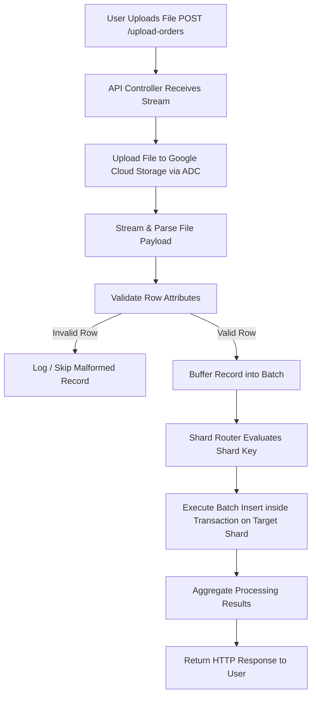
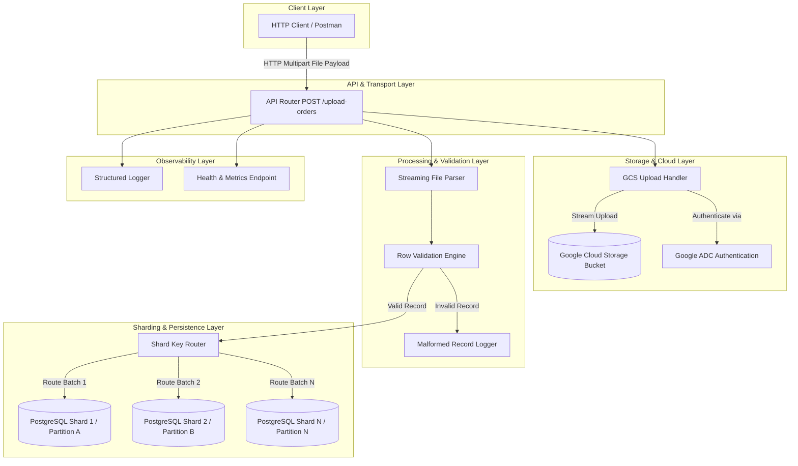

# Backend Engineering Assessment Overview

## 1. Project Summary

### Assessment Purpose
The purpose of this backend engineering assessment is to evaluate a candidate's ability to architect, implement, and document a high-performance, production-ready Node.js backend application. The system must ingest large order datasets (~10,000 records per file), store raw files in cloud object storage via Google Cloud Storage (GCS) using Application Default Credentials (ADC), stream and validate record payloads, and persist validated records into a horizontally scalable, sharded PostgreSQL database cluster.

### Business Objective
The primary business objective is to establish an automated, reliable, and auditable data ingestion pipeline capable of accepting bulk order files from external clients or upstream systems. The system must ensure that raw uploaded files are preserved in secure cloud storage for archival and auditing purposes, while transforming and loading the record contents into a database structure designed to scale seamlessly with growing order volumes without system degradation.

### Technical Objective
The technical objective is to demonstrate core backend engineering competencies, including:
- Memory-efficient data processing using Node.js streams.
- Secure, credential-less cloud authentication via Google Application Default Credentials (ADC).
- Relational database schema design and horizontal scalability using sharding strategies in PostgreSQL.
- High-throughput database writes using batch insertion techniques and database transactions.
- Robust error isolation and structured logging across file upload, parsing, validation, and database storage phases.
- Clean application architecture adhering to separation of concerns and maintainability principles.

---

## 2. Problem Statement

Modern enterprise applications routinely process bulk data imports containing tens of thousands of transaction records. Loading entire bulk files into server memory causes high RAM consumption, process starvation, and server crashes under concurrent load. Furthermore, monolithic database tables eventually suffer performance bottlenecks during high-volume write operations and complex queries.

To solve this problem, the candidate is required to build a Node.js backend application that:
1. Accepts bulk order dataset files (~10,000 records per file).
2. Archives the raw orders file in a Google Cloud Storage (GCS) bucket authenticating via Google Application Default Credentials (ADC).
3. Streams, parses, and validates order record attributes efficiently without loading the complete file into memory.
4. Persists the validated order data into a PostgreSQL database architecture designed for horizontal scalability using database sharding.

---

## 3. Primary Goal

What success looks like for this project:
- **Functional Pipeline**: A fully functional Node.js application that successfully processes bulk order files from ingestion to database storage.
- **Cloud Integration**: Seamless authentication and file upload to Google Cloud Storage utilizing ADC without any committed service account credentials or static secret keys.
- **Stream-Based Ingestion**: Ingesting and parsing ~10,000 rows utilizing Node.js streaming mechanisms, maintaining a constant low memory footprint during processing.
- **Sharded Persistence**: Correct implementation and application routing of data into PostgreSQL logical/physical shards using a documented shard key strategy.
- **Batch & Transactional Execution**: Database persistence executed via chunked batch inserts wrapped in SQL transactions for optimal write performance and atomicity.
- **Resilient Operations**: Graceful handling of invalid or malformed rows without process termination, supported by structured logging tracking lifecycle execution.
- **Comprehensive Documentation**: Delivery of SQL migration scripts, `.env.example` configurations, and an exhaustive `README.md` detailing operational instructions, ADC setup, sharding strategy rationale, and architectural trade-offs.

---

## 4. Scope

### In Scope
Based strictly on the assessment requirements, the following items are within scope:
- **File Format Support**: Acceptance of order dataset files in CSV or Excel format (candidate's choice).
- **Cloud Archival**: Uploading ingested orders files to Google Cloud Storage (GCS).
- **Authentication**: Implementing Google Application Default Credentials (ADC) via local `gcloud` context or Workload Identity.
- **Data Ingestion & Parsing**: Streaming file parsing capable of processing ~10,000 records without loading full payloads into memory.
- **Order Data Schema**: Ingesting minimum order fields: `order_id` (String/UUID), `customer_id` (String), `order_date` (Timestamp), `order_amount` (Decimal), and `status` (String).
- **Row Validation & Error Isolation**: Gracefully managing malformed or invalid rows (skipping, logging, or separating).
- **PostgreSQL Database Storage**: Designing PostgreSQL schemas with appropriate data types and indexes to support high-volume reads and writes.
- **Database Sharding**: Implementing a horizontal sharding architecture (Application-level sharding, PostgreSQL table partitioning, or multiple database instances) with routing logic using a chosen shard key (`customer_id`, hash of `order_id`, or `order_date`).
- **Performance Optimizations**: Utilizing batch inserts, database transactions, and stream processing.
- **API Endpoints**:
  - Mandatory: `POST /upload-orders`
  - Optional/Bonus: `GET /orders/:orderId`, `GET /orders?customerId=`
- **Logging & Monitoring**: Implementing structured logs for upload start/end, processing status, and failed records.
- **Deliverables**: Git repository containing source code, `README.md`, SQL schema/migration scripts, and `.env.example`.
- **Bonus Capabilities**: Background processing (queues/workers), retry and idempotency mechanisms, Docker containerization setup, unit/integration testing, health check/metrics endpoints.

### Out of Scope
The following items are explicitly out of scope for this assessment:
- **Frontend Development**: User interfaces, web forms, or visual dashboards (API clients such as Postman or cURL suffice).
- **Payment Processing**: Third-party payment gateway integration or monetary settlement logic.
- **Multi-Tenant Authorization**: Complex role-based access control (RBAC), OAuth2 providers, or user session management.
- **Multi-Region Cloud Deployment**: Provisioning cloud infrastructure, Kubernetes clusters, or multi-region failovers (local execution with GCS integration is required).
- **Third-Party Reporting Systems**: Data warehouse exports, BI tool integrations, or analytics dashboards.

---

## 5. Functional Requirements

### 5.1 File Upload
- The application must expose an HTTP endpoint (`POST /upload-orders`) capable of receiving multi-part file uploads containing bulk order datasets.
- Supported file formats include CSV or Excel format (candidate's choice).

### 5.2 Google Cloud Storage Upload
- The application must upload the received orders file directly to a designated Google Cloud Storage (GCS) bucket.
- Authentication with Google Cloud Platform services must use Google Application Default Credentials (ADC) (e.g., via `gcloud auth application-default login` locally or Workload Identity in cloud environments).
- Absolute prohibition against committing service account JSON key files or hardcoding cloud credentials within source repositories.

### 5.3 File Parsing
- The file parsing logic must consume the incoming order dataset as a stream.
- Processing must occur sequentially or in chunks to prevent loading the full ~10,000-record file into application memory at any point during execution.

### 5.4 File Validation
- Every parsed record must be evaluated against standard schema constraints for mandatory attributes:
  - `order_id`: String / UUID representation.
  - `customer_id`: String identifier.
  - `order_date`: Valid Timestamp representation.
  - `order_amount`: Valid Decimal value.
  - `status`: String representation.
- Malformed or invalid rows (e.g., missing mandatory fields, invalid data types, parse errors) must be handled gracefully without causing process crashes or aborting valid row insertions.

### 5.5 PostgreSQL Storage
- Validated order records must be persisted into a PostgreSQL database environment.
- Tables must utilize optimal column data types, primary keys, and performance indexes tailored for high-volume write operations and read queries.

### 5.6 Sharding
- The database storage layer must be sharded to enable horizontal scalability.
- Application logic must implement shard routing mechanics to calculate the destination shard for each record/batch and direct write queries accordingly.
- Supported sharding techniques include application-level sharding, PostgreSQL table partitioning, or multi-database routing using shard keys (`customer_id`, hash of `order_id`, or `order_date`).

### 5.7 API
- **Required**: `POST /upload-orders` – Accepts the orders file payload, coordinates GCS upload, triggers stream processing and sharded database storage, and returns an HTTP response detailing execution outcome or status.
- **Optional (Bonus)**:
  - `GET /orders/:orderId` – Retrieves single order record by identifier.
  - `GET /orders?customerId=` – Retrieves order history filtered by customer identifier.

### 5.8 Error Handling
- The application must implement error boundaries across key operational failure points:
  - File upload errors (network dropouts, GCS authorization failures, bucket missing).
  - Parsing errors (corrupted files, malformed headers, invalid row delimiters).
  - Database persistence errors (connection pool timeouts, constraint conflicts, transaction failures).

### 5.9 Logging
- The application must generate clear, actionable log outputs covering:
  - Ingestion start and completion lifecycle events.
  - Ingestion progress and batch execution metrics.
  - Granular logs detailing malformed or rejected records for debugging and auditing.

---

## 6. Non-Functional Requirements

### 6.1 Scalability
- **Horizontal Scaling**: The database tier must support scaling out across logical partitions or multiple database nodes using sharding, preventing single-node bottlenecks as dataset sizes grow.
- **Application Statelessness**: The backend application should ideally remain stateless to allow running multiple application instances behind a load balancer. `[Recommendation]`

### 6.2 Performance
- **High Throughput**: Capable of streaming, validating, and persisting ~10,000 records within minimal execution time.
- **Low Memory Overhead**: Enforced through stream-based file processing, avoiding full-file RAM allocation.
- **Optimized Writes**: Database writes executed in bulk batches wrapped in database transactions to minimize network round-trips and I/O lock overhead.

### 6.3 Maintainability
- **Clean Architecture**: Modular codebase separating transport routes, business logic, stream transforms, shard routing, and cloud storage providers.
- **Self-Documenting Code & Schemas**: Idiomatic Node.js code with typed or validated schemas and clear configuration definitions.

### 6.4 Reliability
- **Transactional Consistency**: Database operations per chunk executed inside transactions to guarantee atomicity (all-or-nothing per batch).
- **Fault Isolation**: Row validation errors isolated so malformed rows do not crash the application or prevent valid records from being persisted.

### 6.5 Security
- **Zero Static Credentials**: Strict adherence to Google ADC, ensuring zero service account keys or plaintext secrets exist in code repositories.
- **Input Sanitization**: Database write queries parameterized to eliminate SQL injection vulnerabilities. `[Recommendation]`

### 6.6 Clean Architecture
- Clear boundary separation among HTTP controllers, file streaming handlers, validation engines, shard key routers, and database access objects.

---

## 7. Expected Workflow

The end-to-end operational flow follows a sequential ingestion and processing pipeline. Upon receiving a bulk file via HTTP upload, the system concurrently or sequentially archives the raw file to cloud storage, streams records through a validation transformer, routes batches through the shard key router, executes batch SQL transactions against target database shards, and returns a execution status response to the caller.

### End-to-End Business Flow Diagram



---

## 8. High-Level Architecture

The system comprises modular components working together to achieve streaming ingestion, cloud archival, data validation, and sharded persistence.

### Architectural Component Breakdown

1. **Client**: HTTP client (e.g., Postman, cURL, or front-end service) initiating file upload requests.
2. **API Layer**: Express/Fastify HTTP routing controllers responsible for request intake, file parsing middleware, and HTTP response formatting.
3. **Upload Layer**: Stream wrapper coordinating direct streaming uploads to cloud object storage.
4. **Storage Layer**: Google Cloud Storage (GCS) bucket serving as the durable raw file repository, authenticated dynamically via ADC.
5. **Processing Layer**: Node.js Stream transformers handling chunks of binary/text file data and parsing them into JSON row objects.
6. **Validation Layer**: Rule engine verifying record attributes (`order_id`, `customer_id`, `order_date`, `order_amount`, `status`) against type definitions and business constraints.
7. **Shard Router**: Component evaluating record attributes against chosen shard keys and resolving the target PostgreSQL connection instance or table partition.
8. **Database Layer**: PostgreSQL sharded setup (multiple database instances or partitioned tables) storing order records.
9. **Logging**: Structured logger (e.g., Pino or Winston) capturing operational milestones, execution timers, and error events. `[Recommendation]`
10. **Monitoring & Health Layer**: Optional health check endpoints and performance metrics reporters.

### System Architecture Diagram



---

## 9. Database Expectations

The database engineering requirements center on achieving scalability and high write performance for bulk ingestion workloads without designing specific schema tables in advance.

### 9.1 Schema & Indexing Principles
- **Schema Optimization**: Choose native PostgreSQL column types (e.g., `UUID`/`VARCHAR` for identifiers, `TIMESTAMPTZ` for timestamps, `NUMERIC`/`DECIMAL` for monetary values).
- **Strategic Indexing**: Design indexes that accelerate primary lookups (`order_id`, `customer_id`) while carefully balancing index write overhead during bulk ingestion.

### 9.2 High-Volume Inserts & Batch Operations
- **Single-Row Avoidance**: Explicit requirement to avoid single-row `INSERT INTO ...` statements in loops.
- **Batch Chunking**: Grouping incoming validated records into multi-row batch insert statements (e.g., 500–1000 records per SQL statement) to optimize I/O performance and network usage.

### 9.3 Transactions
- **Atomic Batches**: Wrapping batch insertion chunks within explicit database transactions (`BEGIN` ... `COMMIT`).
- **Rollback Safety**: Ensuring that database write failures trigger immediate transaction rollbacks (`ROLLBACK`) for the affected batch, preserving data integrity.

### 9.4 Horizontal Scalability
- **Partitioning / Sharding**: Storage architecture designed to distribute data volume across distinct tables, schemas, or PostgreSQL database instances, mitigating single-table bloat and lock contention.

---

## 10. Sharding Overview

### 10.1 What Sharding Is
Sharding is a database architecture pattern that horizontally partitions data across multiple database instances, tables, or schemas. Instead of maintaining a single massive database table, rows are distributed across multiple sub-tables or nodes based on a deterministic rule known as a **Shard Key**.

### 10.2 Why Sharding is Required
In high-volume backend systems, single-node databases eventually encounter write bottlenecks, disk I/O limits, CPU saturation, and slow indexing performance. Sharding resolves these limitations by:
- Spreading write workloads across multiple database nodes or partitions.
- Reducing table index depth and maintenance overhead per database instance.
- Supporting horizontal scaling by allowing new shards to be added as dataset volume increases.

### 10.3 Candidate Sharding Strategies Listed in Assessment
The assessment outlines three acceptable sharding approaches:

1. **Application-Level Sharding (Recommended by Assessment)**:
   - Application code maintains connections to multiple distinct PostgreSQL databases.
   - Shard router in Node.js calculates destination shard index and directs queries to specific database connection pools.
2. **PostgreSQL Table Partitioning**:
   - PostgreSQL native declarative partitioning (e.g., `PARTITION BY HASH` or `PARTITION BY RANGE`).
   - Database engine handles partition routing internally under a parent table.
3. **Multiple PostgreSQL Databases with Routing Logic**:
   - Explicit database routing layer directing client queries to discrete database servers based on domain metadata.

### 10.4 Shard Key Options Listed in Assessment
Candidates may choose one of the following shard keys:
- **`customer_id`**: Groups orders belonging to the same customer within the same shard (ideal for customer-centric queries).
- **Hash of `order_id`**: Applies a cryptographic/modulo hash algorithm to `order_id` to achieve uniform distribution across shards.
- **Time-based sharding using `order_date`**: Partitions data by time windows (e.g., monthly/yearly), ideal for time-series analytics and archival strategies.

### 10.5 Application Responsibilities
- Implementing deterministic shard calculation logic.
- Managing database connection pools across all target shards.
- Guaranteeing that records are written strictly to their target shard destinations.
- Providing documentation explaining the trade-offs and rationale behind the chosen strategy.

---

## 11. API Overview

### 11.1 Required Endpoint

#### `POST /upload-orders`
- **Purpose**: Main endpoint for bulk order file ingestion.
- **Responsibilities**:
  - Accept multi-part form data uploads containing the orders file (CSV or Excel).
  - Initiate file archival to Google Cloud Storage using ADC authentication.
  - Execute stream parsing, row validation, and sharded PostgreSQL batch persistence.
  - Return an HTTP response detailing file upload status, total records processed, valid rows inserted, and malformed rows skipped.

### 11.2 Optional (Bonus) Endpoints

#### `GET /orders/:orderId`
- **Purpose**: Retrieve a single order by its unique identifier.
- **Responsibilities**:
  - Accept `orderId` path parameter.
  - Evaluate shard routing logic (or query across shards if non-hash sharded) to locate the target shard.
  - Return record details or 404 Not Found if missing.

#### `GET /orders?customerId=`
- **Purpose**: Retrieve all orders for a specific customer.
- **Responsibilities**:
  - Accept `customerId` query parameter.
  - Route query directly to the corresponding shard storing that customer's records.
  - Return collection of matching order records.

#### `GET /health` or `GET /metrics` `[Recommendation]`
- **Purpose**: Application observability.
- **Responsibilities**:
  - Provide database connectivity status across shards, GCS bucket reachability, and memory/CPU metrics.

---

## 12. Google Cloud Requirements

### 12.1 Google Cloud Storage (GCS)
- Mandatory integration for raw orders file storage upon upload.
- Ensures all ingested datasets are backed up in durable cloud object storage prior to or during parsing.

### 12.2 Application Default Credentials (ADC)
- The application must authenticate with GCP APIs using Application Default Credentials (ADC).
- **Local Development Context**: Authenticated via Google Cloud CLI command:
  ```bash
  gcloud auth application-default login
  ```
- **Production / Deployed Context**: Utilizes Google Workload Identity or Service Account association bound to the hosting environment (e.g., GKE, Cloud Run, Compute Engine).

### 12.3 Security Mandate: No Static Credentials
- Explicit rule: **No service account key JSON files or hardcoded API keys may be committed to the code repository**.
- Using ADC guarantees security compliance by delegating credentials management to the local developer environment or cloud identity framework.

---

## 13. Error Handling Expectations

The assessment requires systematic error boundary management across three primary operational domains:

### 13.1 File Upload Failures
- **Scenarios**: GCS bucket unreachable, authentication token expired, network socket timeout, invalid bucket permissions.
- **Handling Expectation**: Intercept GCS errors, abort or retry cloud storage operation, log failure details, and return descriptive HTTP 5xx error responses without crashing the Node.js process.

### 13.2 Parsing Errors
- **Scenarios**: Corrupted CSV/Excel structure, unexpected character encoding, missing header row, malformed delimiters.
- **Handling Expectation**: Intercept stream parsing errors gracefully. If individual rows are malformed, isolate the malformed row, log the error, and continue parsing subsequent valid rows. If the entire file format is invalid, abort processing with an appropriate HTTP 400 Bad Request error.

### 13.3 Database Insert Failures
- **Scenarios**: PostgreSQL connection pool exhaustion, database shard node offline, constraint violation (e.g., duplicate primary key), transaction deadlock.
- **Handling Expectation**: Roll back active SQL batch transactions on affected shards, log error details, isolate failed batches or retry if idempotent, and ensure database state remains consistent.

---

## 14. Logging Expectations

Application logging must be structured, clear, and informative. Required log categories include:

### 14.1 File Upload Logs
- **Upload Start**: Log timestamp, source filename, payload byte size, target GCS bucket name.
- **Upload End**: Log GCS file path/URI, elapsed upload duration, upload success status.

### 14.2 Processing Status Logs
- **Ingestion Milestone**: Log starting of file streaming and parsing.
- **Batch Metric Logs**: Log periodic batch insertion status (e.g., "Processed 5,000 / 10,000 records across Shard A and Shard B").
- **Ingestion Complete**: Log final statistics: total runtime, total rows read, total inserted rows, total malformed rows.

### 14.3 Failed Records Logs
- **Row-Level Failures**: Log specific row indices or line numbers that failed validation.
- **Failure Cause**: Include exact failure reasons (e.g., "Row 412: invalid decimal value for order_amount", "Row 1054: missing customer_id").

---

## 15. Deliverables

Candidates must submit a Git repository containing the following assets:

1. **Source Code**: Fully functional Node.js application codebase adhering to clean code standards.
2. **`README.md` File**: Comprehensive markdown documentation containing:
   - Environment setup and execution instructions.
   - Configuration guide for Google Application Default Credentials (ADC).
   - Detailed explanation of chosen sharding strategy and routing logic.
   - Architectural trade-off analysis and design decisions.
3. **Database Migration Scripts**: SQL schema DDL scripts or migration tool configurations to setup PostgreSQL tables, partitions, or sharded database instances.
4. **Environment Template (`.env.example`)**: Configuration template detailing required environment variables (e.g., GCS bucket name, database connection strings, port definitions) without sensitive secret values.

---

## 16. Evaluation Criteria

Candidate submissions are evaluated based on core criteria and bonus implementations:

### Core Evaluation Matrix

| Area | Reviewer Expectations |
| :--- | :--- |
| **Node.js** | Stream-based file processing, efficient asynchronous handling, clean architectural modularity. |
| **PostgreSQL** | Optimal schema design, column data types, strategic indexing, chunked batch insert implementation. |
| **Sharding** | Correct application routing or table partitioning implementation, clear technical rationale. |
| **GCP Integration** | Flawless ADC authentication setup, clean Google Cloud Storage SDK file upload execution. |
| **Code Quality** | Code readability, structural modularity, separation of concerns, error boundary maintenance. |

### Bonus Criteria
- **Background Worker Queues**: Asynchronous background queue processing (e.g., BullMQ / RabbitMQ) offloading ingestion work from the main HTTP thread.
- **Retry & Idempotency**: Idempotent upload handling and resilient retry mechanisms for transient database or network failures.
- **Dockerized Setup**: Dockerfile and `docker-compose.yml` orchestrating application containers alongside sharded PostgreSQL instances.
- **Testing Suite**: Automated unit or integration test suite covering stream transformers, row validators, and shard routing logic.
- **Architectural Separation**: Clean multi-layer architecture isolating HTTP handlers, domain logic, and persistence infrastructure.

---

## 17. Development Constraints

- **Time Horizon**: Total estimated completion time is **24 Hours**.
- **Scope Focus**: Backend logic, streaming performance, cloud authentication, and database system design take strict priority over frontend engineering.
- **Memory Constraint**: Strict prohibition against buffering the entire ~10,000-record file into Node.js application RAM at once.

---

## 18. Risks

Based strictly on the assessment requirements, the following technical risks must be accounted for:

1. **Memory Exhaustion Risk**: Attempting to parse CSV/Excel files using non-streaming synchronous parsers will buffer 10,000 records in RAM, leading to Node.js garbage collection pauses or process crashes under load.
2. **GCP ADC Misconfiguration Risk**: Local developer environments lacking standard `gcloud` ADC setup will fail GCS upload operations.
3. **Shard Hotspotting / Data Skew Risk**: Choosing an un-hashed shard key (e.g., un-hashed `order_id` or non-uniformly distributed `customer_id`) may route a disproportionate percentage of data to a single shard, negating horizontal scaling benefits.
4. **Transaction Overhead Risk**: Executing batch transactions that are too large may cause database lock contention, whereas batches that are too small generate excessive network round-trips.
5. **Partial Ingestion Failure Risk**: Ingestion processes failing midway could result in duplicated records unless idempotency mechanisms or transaction boundaries are configured.

---

## 19. Assumptions

The following operational assumptions are noted for implementation clarity:

- **[Assumption] Environment Availability**: The developer environment has access to a working PostgreSQL engine (version 12+) and Node.js runtime (v18+ LTS).
- **[Assumption] GCS Bucket Access**: An active Google Cloud project with GCS API enabled and an accessible GCS storage bucket exists for ADC authentication testing.
- **[Assumption] CSV/Excel Header Row**: Ingested files contain a standard header row mapping to required field names (`order_id`, `customer_id`, `order_date`, `order_amount`, `status`).
- **[Assumption] Local Multi-Database Execution**: For application-level sharding, running multiple local PostgreSQL containers on distinct ports (e.g., 5432, 5433) is acceptable for demonstrating multi-database routing logic.

---

## 20. Open Questions

Areas not fully specified in the assessment PDF that candidates may clarify or document in their `README.md`:

1. **Duplicate Record Strategy**: Should duplicate `order_id` records in an upload file overwrite existing records (`ON CONFLICT DO UPDATE`), be ignored (`ON CONFLICT DO NOTHING`), or be flagged as validation errors?
2. **GCS Storage Retention & Naming**: Are uploaded GCS files required to maintain their original filenames, or should they be prepended with timestamps/UUIDs to prevent object overwrites in cloud storage?
3. **Async vs Sync Response Contract**: Should `POST /upload-orders` block until all 10,000 records are fully inserted into PostgreSQL, or should it return a `202 Accepted` job status token if background queue processing is implemented?
4. **Failed Row Persistence**: Should malformed rows be logged solely to stdout/files, or should a dedicated `failed_orders` table/dead-letter table be provided in PostgreSQL?

---

## 21. Glossary

| Term | Technical Definition |
| :--- | :--- |
| **ADC (Application Default Credentials)** | A GCP authentication strategy that automatically searches for credentials in the local environment (`gcloud` login, service account environment variables, or Workload Identity) without static key files. |
| **GCS (Google Cloud Storage)** | Google Cloud Platform's scalable, highly durable blob/object storage service used for storing unstructured files. |
| **Sharding** | A database architecture pattern that horizontally distributes rows across independent physical or logical databases using a shard key. |
| **Streaming** | An asynchronous data handling technique in Node.js where file payloads are processed in continuous small chunks instead of buffering the full dataset in memory. |
| **Batch Insert** | Executing a single SQL command containing multiple data rows (e.g., `INSERT INTO orders VALUES (...), (...), (...)`) to maximize throughput. |
| **Transaction** | A logical unit of database work (wrapped in `BEGIN` and `COMMIT`) ensuring ACID properties: either all statements succeed or all are rolled back. |
| **Partitioning** | Splitting a single large database table into smaller child tables managed by the database engine (e.g., PostgreSQL declarative range/hash partitioning). |
| **Horizontal Scaling** | Adding more database instances or nodes to share computational and storage load, as opposed to vertical scaling (upgrading CPU/RAM on a single machine). |

---

## 22. Module Summary

This module overview establishes the comprehensive architectural and functional baseline for the **Backend Engineering Assessment**. The target system is a robust Node.js bulk order ingestion backend designed to process datasets of ~10,000 records efficiently. Key architectural tenets include memory-conscious stream parsing, secure credential-less GCP integration via Application Default Credentials (ADC), and a horizontally scalable sharded PostgreSQL database tier.

By adhering strictly to clean code modularity, batch SQL transaction mechanics, gracefully isolated row validation boundaries, and structured logging, the application fulfills all core assessment requirements and sets up a foundation for bonus capabilities such as background worker processing and containerized Docker execution.
