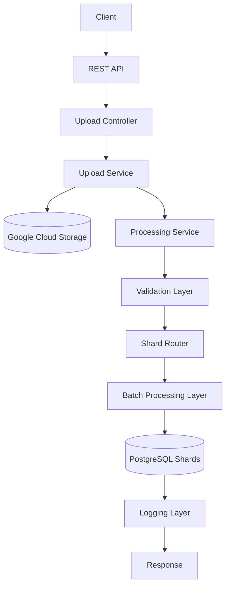
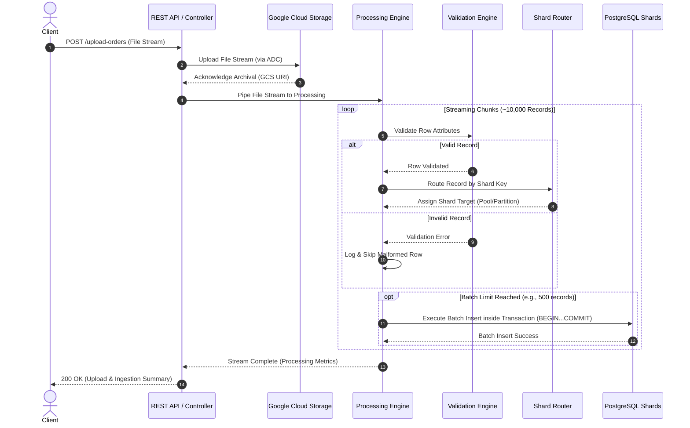
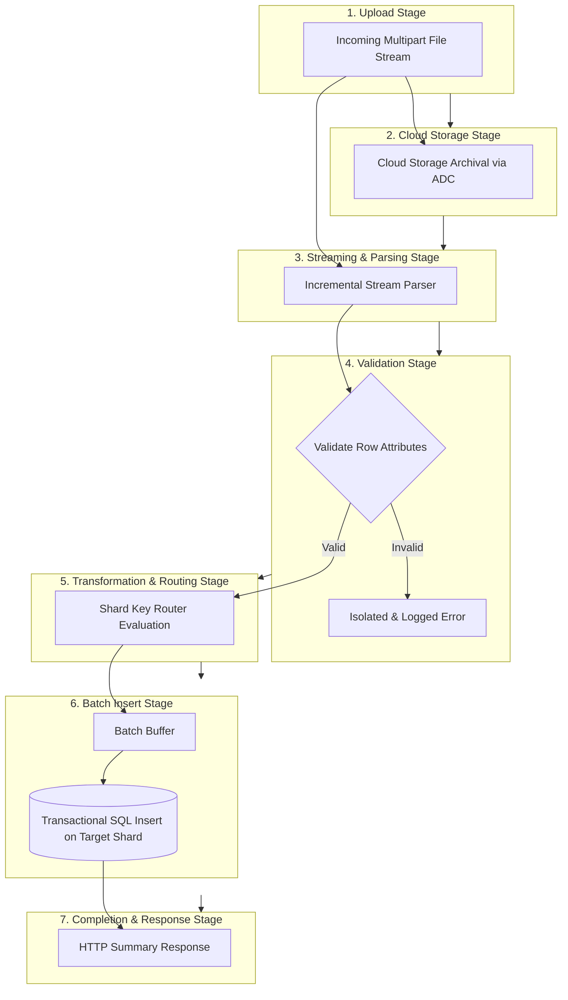
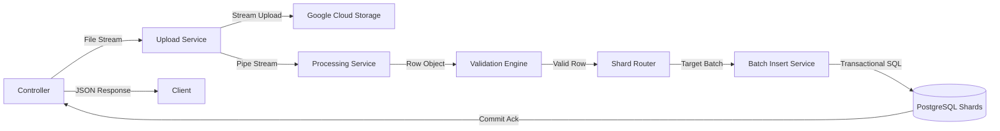
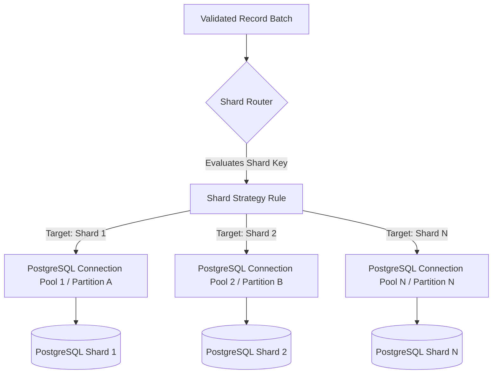
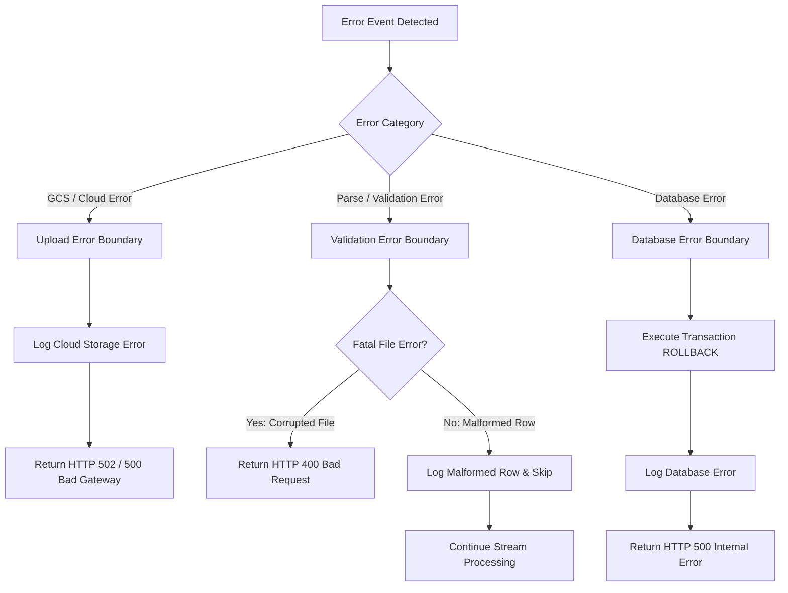
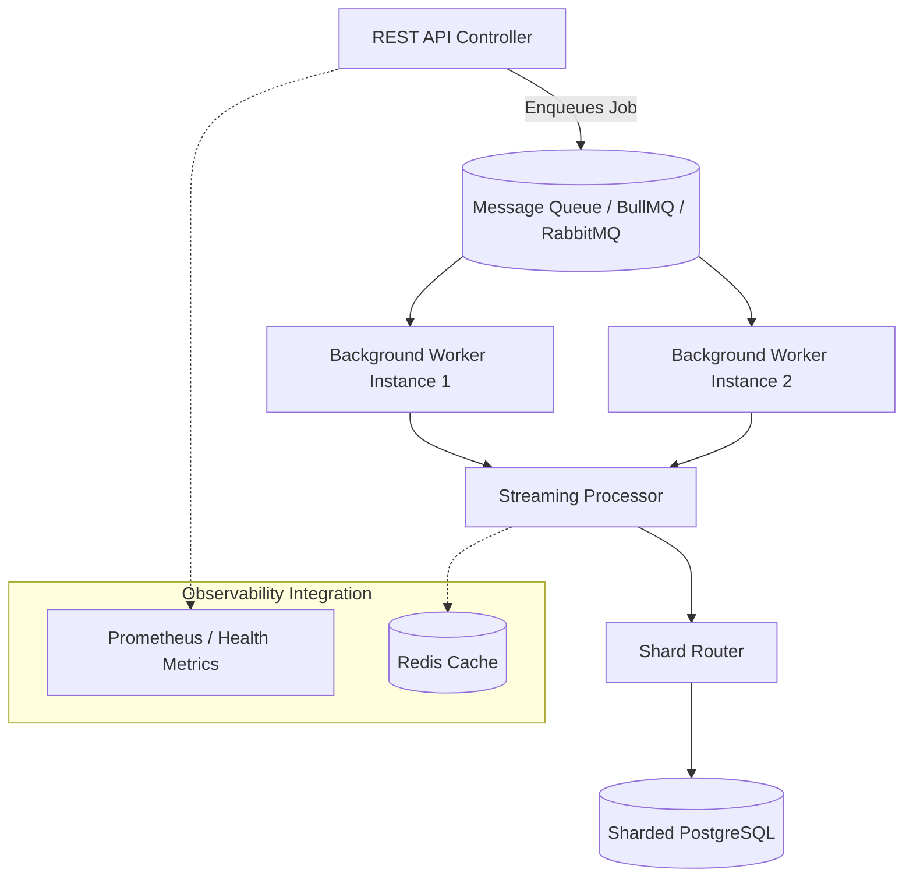

# System Architecture

## 1. Purpose

The purpose of this System Architecture document is to define the technical design and architectural topology for the **Backend Engineering Assessment** system. The system is designed to solve the challenges of ingesting, validating, transforming, and persisting bulk dataset files (~10,000 order records per file) under strict memory, throughput, and scalability constraints.

Traditional monolithic backend systems frequently attempt to read entire uploaded files into application memory (RAM), causing memory spikes, process crashes, and thread blocking. Furthermore, persisting large datasets into a single database instance creates disk I/O bottlenecks and transaction contention. 

This architecture addresses these challenges by establishing:
1. **Streaming Data Ingestion**: Processing file payloads incrementally to maintain a low, bounded RAM footprint.
2. **Cloud Object Archival**: Preserving raw upload files in Google Cloud Storage (GCS) using Application Default Credentials (ADC) without static service account keys.
3. **Horizontally Scalable Database Infrastructure**: Distributing write workloads across a sharded PostgreSQL database setup using application routing or native table partitioning.
4. **Batch & Transactional Execution**: Grouping records into chunked bulk inserts wrapped in database transactions to maximize throughput and ensure data atomicity.

---

## 2. Architecture Goals

The system architecture is engineered to fulfill the following quality attributes and non-functional requirements:

- **Scalability**: Capable of handling growing order volumes by distributing database persistence across multiple PostgreSQL shards (logical partitions or physical database instances).
- **High Performance**: Achieving rapid file ingestion (~10,000 records) through stream parsing and chunked batch writes, avoiding single-row database queries.
- **Reliability**: Maintaining database state integrity via transactional boundaries (`BEGIN`/`COMMIT`/`ROLLBACK`) and isolating invalid row errors so they do not crash processing.
- **Maintainability**: Applying clean architecture principles to separate transport interfaces, business processing logic, stream transformation, and database infrastructure.
- **Modular Design**: Structuring components with clear boundaries, allowing modules (such as cloud storage providers or shard routers) to be updated independently.
- **Cloud Integration**: Incorporating Google Cloud Storage (GCS) utilizing Google Application Default Credentials (ADC) for secure, keyless authentication.
- **Efficient File Processing**: Streaming file payloads directly from upload requests to avoid loading complete payloads into memory.

---

## 3. High-Level Architecture

The high-level architecture organizes the application into distinct functional modules: Transport/API layer, Cloud Storage layer, Streaming Parsing & Validation pipeline, Shard Router, and Sharded Database layer.

### High-Level Architecture Flowchart



---

## 4. Component Overview

This section defines every primary architectural component, detailing its purpose, responsibilities, input/output contracts, and dependencies.

### 4.1 Client
- **Purpose**: External caller initiating bulk file upload operations or querying stored orders.
- **Responsibilities**: Formats multi-part HTTP requests containing CSV/Excel files; receives processing outcome responses.
- **Input**: User actions, order dataset files.
- **Output**: Multi-part HTTP `POST` payloads or `GET` query parameters.
- **Dependencies**: External network access to the API gateway/endpoint.

### 4.2 REST API
- **Purpose**: Entry gateway exposing HTTP endpoints to clients.
- **Responsibilities**: Routes incoming HTTP requests, handles protocol header negotiation, and enforces request payload limits.
- **Input**: HTTP request streams.
- **Output**: Routed HTTP context, HTTP status codes, and JSON responses.
- **Dependencies**: Controller modules, HTTP server framework.

### 4.3 Controller (Upload Controller)
- **Purpose**: Transport adapter managing file upload HTTP execution.
- **Responsibilities**: Extracts incoming file streams from requests, delegates tasks to the Upload Service, and maps domain service outcomes to HTTP response codes.
- **Input**: Multipart HTTP request objects.
- **Output**: HTTP response payloads (status metrics, execution success/failure details).
- **Dependencies**: REST API, Upload Service.

### 4.4 Upload Service
- **Purpose**: Coordinator for raw file cloud archival and ingestion execution.
- **Responsibilities**: Initiates parallel or sequential streaming to Google Cloud Storage and passes file streams to the Processing Engine.
- **Input**: Multi-part file streams, file metadata.
- **Output**: Cloud object URI, processing status summary.
- **Dependencies**: Google Cloud Storage SDK, Processing Engine, Logger.

### 4.5 Google Cloud Storage (GCS)
- **Purpose**: Durable cloud object storage repository for raw upload datasets.
- **Responsibilities**: Retains uploaded CSV/Excel files for auditability, archival, and data recovery.
- **Input**: Raw file byte streams.
- **Output**: Cloud storage object metadata, read streams (if retrieved).
- **Dependencies**: Google ADC authentication context.

### 4.6 CSV/Excel Reader
- **Purpose**: Stream parser transforming raw byte chunks into record objects.
- **Responsibilities**: Parses binary/text streams row-by-row into JavaScript objects without loading full file contents into memory.
- **Input**: Binary/Text file streams.
- **Output**: Individual record objects / JSON row representations.
- **Dependencies**: Stream processing utilities.

### 4.7 Validation Engine
- **Purpose**: Business rule evaluator inspecting row payload integrity.
- **Responsibilities**: Verifies required attributes (`order_id`, `customer_id`, `order_date`, `order_amount`, `status`) and data types; isolates malformed rows.
- **Input**: Raw parsed row objects.
- **Output**: Validated row objects OR validation error records.
- **Dependencies**: Business domain rule definitions.

### 4.8 Processing Engine
- **Purpose**: Pipeline orchestrator directing stream flows from reader to validator to shard router.
- **Responsibilities**: Controls backpressure, buffers valid records into chunked batches (e.g., 500–1000 records), and tracks ingestion progress counters.
- **Input**: Row stream from CSV/Excel Reader.
- **Output**: Chunked record batches sent to the Shard Router.
- **Dependencies**: CSV/Excel Reader, Validation Engine, Shard Router, Logger.

### 4.9 Shard Router
- **Purpose**: Deterministic database routing coordinator.
- **Responsibilities**: Evaluates shard key (`customer_id`, hash of `order_id`, or `order_date`) per record/batch to resolve the target database connection or partition.
- **Input**: Validated record objects / batches.
- **Output**: Targeted record batches routed to specific database shard connections.
- **Dependencies**: Database Layer connection pools, Shard Key Strategy configuration.

### 4.10 Batch Insert Service
- **Purpose**: High-throughput database write engine.
- **Responsibilities**: Composes bulk `INSERT` statements for target database shards and executes write operations inside explicit SQL transactions.
- **Input**: Shard-routed record batches.
- **Output**: Transaction execution results (rows inserted, execution duration, SQL errors).
- **Dependencies**: Database Layer connection pools.

### 4.11 Database Layer (Sharded PostgreSQL)
- **Purpose**: Scalable relational persistence engine.
- **Responsibilities**: Persists validated order records across logical partitions or multiple PostgreSQL database instances.
- **Input**: SQL batch commands, transaction blocks.
- **Output**: Query result sets, transaction commit/rollback acknowledgments.
- **Dependencies**: PostgreSQL engine instances.

### 4.12 Logging Layer
- **Purpose**: Centralized application log aggregator.
- **Responsibilities**: Emits structured log events for file upload lifecycles, processing metrics, and malformed row errors.
- **Input**: Log events, exception stack traces, execution metrics.
- **Output**: Formatted log lines (stdout/file streams).
- **Dependencies**: Logging framework (e.g., Pino/Winston) `[Recommendation]`.

### 4.13 Configuration Layer
- **Purpose**: Centralized application configuration reader.
- **Responsibilities**: Loads environment variables, GCP ADC context, database connection strings, and application settings.
- **Input**: Environment variables, system environment.
- **Output**: Read-only configuration objects.
- **Dependencies**: System environment files (`.env`).

### 4.14 Error Handler
- **Purpose**: Global exception boundary manager.
- **Responsibilities**: Intercepts unhandled processing exceptions, triggers database transaction rollbacks, formats structured error logs, and returns clean HTTP error responses.
- **Input**: Uncaught exceptions, rejected promises, service errors.
- **Output**: Formatted error response objects, error logs.
- **Dependencies**: Logger, REST API framework.

---

## 5. Request Lifecycle

The request lifecycle depicts the chronological sequence of interactions across components during a bulk order file upload (`POST /upload-orders`).

### Request Lifecycle Sequence Diagram



---

## 6. Data Flow

Data flows sequentially through stages of upload, cloud storage streaming, record validation, shard resolution, batch aggregation, and sharded insertion.

### Data Flow Diagram



---

## 7. Processing Pipeline

The step-by-step processing pipeline executes as follows:

1. **Receive File**: The REST API receives an incoming multipart `POST /upload-orders` request containing an orders dataset file in CSV or Excel format.
2. **Store in GCS**: The upload service pipes the file stream directly to a designated Google Cloud Storage bucket, authenticating seamlessly via Google ADC.
3. **Read Stream**: Concurrently or sequentially, the processing service opens an incremental stream reader across the uploaded payload.
4. **Validate**: The stream passes each parsed record to the Validation Engine to verify mandatory fields (`order_id`, `customer_id`, `order_date`, `order_amount`, `status`) and data types. Invalid rows are isolated and logged.
5. **Transform**: Valid records are converted into structured domain entities formatted for database persistence.
6. **Determine Shard**: The Shard Router evaluates the designated shard key (`customer_id`, hash of `order_id`, or `order_date`) to select the destination database pool or table partition.
7. **Add to Batch**: The record is appended to a memory-bounded batch buffer associated with the assigned shard.
8. **Bulk Insert**: When the batch buffer reaches a configured threshold (e.g., 500 records), the Batch Insert Service opens a database transaction (`BEGIN`) and executes a bulk SQL insert statement on the target shard, followed by a transaction `COMMIT`.
9. **Finish**: Upon reaching the end of the file stream, processing metrics are aggregated, final log entries are emitted, and an HTTP success response is returned to the client.

---

## 8. Layered Architecture

The system is organized into five logical layers to enforce clean separation of concerns and maintainability.

```
+-------------------------------------------------------------------+
|                        PRESENTATION LAYER                         |
|   (REST API, Routes, Controllers, Request/Response Adapters)     |
+-------------------------------------------------------------------+
                                  |
+-------------------------------------------------------------------+
|                        APPLICATION LAYER                          |
|   (Upload Service, Ingestion Pipeline Orchestrator, Metrics)      |
+-------------------------------------------------------------------+
                                  |
+-------------------------------------------------------------------+
|                         BUSINESS LAYER                            |
|   (Validation Engine, Order Schema Rules, Shard Key Logic)        |
+-------------------------------------------------------------------+
                                  |
+-------------------------------------------------------------------+
|                       INFRASTRUCTURE LAYER                        |
|   (CSV/Excel Reader, Shard Router, GCS SDK Adapter, Logger)       |
+-------------------------------------------------------------------+
                                  |
+-------------------------------------------------------------------+
|                          STORAGE LAYER                            |
|   (Google Cloud Storage, Sharded PostgreSQL Databases/Partitions) |
+-------------------------------------------------------------------+
```

### Layer Responsibilities

- **Presentation Layer**: Exposes HTTP endpoints, manages request file streaming middleware, handles HTTP protocol status codes, and formats API response bodies.
- **Application Layer**: Orchestrates ingestion workflows, coordinates cloud uploads with streaming parsing, manages transaction boundaries, and aggregates processing metrics.
- **Business Layer**: Enforces domain integrity rules, evaluates row validation constraints, and defines shard key routing rules.
- **Infrastructure Layer**: Provides technical implementations for file stream parsing, cloud storage SDK adapters, database connection pool management, and structured logging engines.
- **Storage Layer**: Physical storage assets including Google Cloud Storage buckets for raw files and sharded PostgreSQL databases/partitions for record persistence.

---

## 9. Component Communication

This section details how components interact during execution.

### Component Communication Diagram



---

## 10. Storage Architecture

The storage architecture combines cloud object storage for raw file archival and sharded relational storage for structured order data.

### 10.1 Google Cloud Storage (GCS)
- **Role**: Object store for raw upload file preservation.
- **Access Pattern**: Write-heavy streaming uploads upon request receipt.
- **Authentication**: Authenticated via Google Application Default Credentials (ADC) without local secret files.

### 10.2 Temporary Processing Storage
- **Role**: Transient in-memory chunk buffers.
- **Access Pattern**: Small, memory-bounded buffers (e.g., 500–1000 rows) managed by stream transformers, ensuring zero disk caching of temporary files unless required for Excel parsing `[Recommendation]`.

### 10.3 PostgreSQL Database Tier
- **Role**: Scalable relational persistence store for structured order records.
- **Access Pattern**: High-volume batch writes during ingestion; indexed single-row or range reads for query endpoints.

### 10.4 Shard Distribution
- **Role**: Horizontal data distribution tier.
- **Access Pattern**: Managed via application-level connection routing or native database partitioning, routing write operations across multiple tables or database nodes.

### 10.5 Logging Storage
- **Role**: Durable log store for operational milestones and error tracking.
- **Access Pattern**: Standard output streams (`stdout`) or log file appenders `[Recommendation]`.

---

## 11. File Processing Architecture

File processing is engineered around stream processing to satisfy strict performance and memory constraints.

### 11.1 Streaming vs. Full-File Buffering
- **Why Streaming is Preferred**: Loading a 10,000-record CSV/Excel file directly into memory allocates massive RAM payloads, triggering heavy Garbage Collection (GC) pauses and risking `ERR_STRING_TOO_LONG` or out-of-memory process crashes under concurrent load. Streaming processes small chunks sequentially, maintaining a constant low memory footprint (e.g., < 50MB RAM).

### 11.2 Memory Usage Control
- Backpressure mechanisms in Node.js streams pause stream reading when downstream validation or database batch writing is slow, ensuring memory consumption remains bounded.

### 11.3 Validation & Batching Workflow
- Stream chunks -> Row transformation -> Validation Engine -> Shard Router -> Batch Buffer (e.g., 500 items) -> Transactional Bulk SQL execution.

### 11.4 Error Handling in Streams
- Stream error events (`error`) are caught by error boundaries to prevent unhandled process crashes. Malformed rows trigger non-fatal warning events, skipping the row while preserving stream continuity.

---

## 12. Sharding Architecture

Sharding distributes order data across multiple logical or physical PostgreSQL databases to achieve horizontal write scalability.

### 12.1 Purpose & Motivation
A single PostgreSQL table eventually suffers from disk I/O bottlenecks, lock contention, and index bloat when processing continuous bulk ingestion. Sharding splits write traffic across distinct partitions or database instances.

### 12.2 Sharding Architecture Topology



### 12.3 Shard Selection & Data Distribution
- **Shard Key Candidates** (from assessment):
  - `customer_id`: Routes records by customer identifier.
  - Hash of `order_id`: Applies a modulo hash (e.g., `hash(order_id) % N`) to achieve uniform data distribution across $N$ shards.
  - Time-based (`order_date`): Routes records into date-partitioned tables/databases (e.g., by month/year).
- **Application Responsibilities**: The Shard Router component maintains connection pool maps for all target shards, executes the deterministic shard key function, and routes batch writes to the appropriate database connection.

---

## 13. Error Handling Architecture

The error handling architecture defines error boundaries and propagation across all system layers.

### Error Propagation Diagram



---

## 14. Logging Architecture

The logging architecture ensures full operational visibility across ingestion lifecycles and component states.

### Log Categories & Detail

| Log Category | Captured Events | Target Level |
| :--- | :--- | :--- |
| **Application Logs** | Server initialization, route registration, shutdown signals. | `INFO` |
| **Upload Logs** | GCS upload start timestamp, target bucket, byte size, GCS URI, elapsed upload time. | `INFO` |
| **Processing Logs** | Ingestion pipeline started, batch execution progress (e.g., "Batch 10 committed"), completion metrics. | `INFO` / `DEBUG` |
| **Validation Logs** | Isolated malformed rows, specific row line numbers, failed validation rules. | `WARN` |
| **Database Logs** | Shard connection pool states, transaction rollback events, query execution errors. | `ERROR` |
| **System Logs** | Uncaught exceptions, process warnings, memory alerts. | `FATAL` / `ERROR` |

---

## 15. Configuration Architecture

Configuration management follows 12-Factor App principles, separating configuration from code via environment variables.

### Configuration Topology

```
                  +-----------------------------------+
                  |   System Environment Variables    |
                  |     (.env / Cloud Config)         |
                  +-----------------------------------+
                                    |
                                    v
                  +-----------------------------------+
                  |       Configuration Layer         |
                  |     (Read-Only Registry)          |
                  +-----------------------------------+
                                    |
        +---------------------------+---------------------------+
        |                           |                           |
        v                           v                           v
+---------------+           +---------------+           +---------------+
| GCS & ADC     |           | Database      |           | Application   |
| Configuration |           | Configuration |           | Configuration |
| (Bucket Name) |           | (Shard Pools) |           | (Port, Batch) |
+---------------+           +---------------+           +---------------+
```

### Key Configuration Domains
- **Google ADC Configuration**: Credentials resolution context via `gcloud` local login or Workload Identity without key files.
- **Storage Configuration**: Target GCS bucket name, upload timeout limits.
- **Database Configuration**: Connection strings, connection pool sizes, and host mappings for PostgreSQL shards.
- **Application Configuration**: Server HTTP port, batch chunk size limits (e.g., 500), log level verbosity.

---

## 16. Scalability Strategy

The architecture incorporates explicit horizontal scalability strategies across all tiers:

- **Horizontal Database Scaling**: Adding logical database shards or PostgreSQL table partitions splits disk I/O and query load linearly.
- **Streaming Large Files**: Processing incoming payloads in small chunks ensures file processing scale is independent of application server RAM capacity.
- **Batch Write Optimization**: Grouping record writes into multi-row SQL transactions drastically reduces network round-trip latency and database CPU usage.
- **Stateless Application Tier**: The API and processing layers hold no persistent local state, allowing multiple Node.js application instances to run behind a load balancer `[Recommendation]`.
- **Future Worker / Queue Readiness**: The architecture decouples file streaming from database persistence, allowing the pipeline to easily hand off batches to background worker queues `[Recommendation]`.

---

## 17. Security Architecture

Security controls protect cloud infrastructure and data integrity without imposing unnecessary user authentication complexity:

- **Credential-Less Authentication (Google ADC)**: Strict reliance on Application Default Credentials eliminates static service account JSON key files, protecting cloud credentials from code repository leaks.
- **Zero Hardcoded Secrets**: All connection strings, cloud bucket names, and ports are injected via environment variables.
- **Input & Payload Validation**: Strict type enforcement in the Validation Engine prevents malformed data payloads from reaching the storage layer.
- **SQL Injection Prevention**: All batch insertion statements use parameterized queries to eliminate SQL injection risks `[Recommendation]`.
- **Secure File Ingestion**: Standard HTTP upload stream limits prevent denial-of-service (DoS) attacks via oversized payloads `[Recommendation]`.

---

## 18. Fault Tolerance

Fault tolerance mechanisms ensure system resilience against partial failures:

- **Row-Level Fault Isolation**: Malformed or invalid dataset rows are caught by the Validation Engine, logged, and skipped without crashing the ingestion stream or aborting valid row persistence.
- **Transaction Rollback Safety**: Database writes per batch are executed inside SQL transactions (`BEGIN` ... `COMMIT`). Any database failure triggers an immediate `ROLLBACK` for that specific batch, ensuring zero corrupt or partial batch states.
- **Graceful Error Recovery**: Cloud upload or database connection drops return clean HTTP error status codes to the client while releasing open stream handlers and connection pool resources.

---

## 19. Future Extensibility

The architecture is designed to accommodate future enterprise requirements without modifying core component boundaries:

### Extensibility Topology



- **Background Workers & Queues**: Upload controllers can enqueue ingestion jobs into background message queues (e.g., BullMQ, RabbitMQ, Kafka) to execute asynchronous processing `[Recommendation]`.
- **Caching Layer**: Redis can be integrated for caching order lookup queries or tracking job progress states `[Recommendation]`.
- **Metrics & Observability**: Prometheus metrics endpoints can be attached to the Application Layer to monitor throughput, batch durations, and memory usage `[Recommendation]`.

---

## 20. Technology Mapping

This table maps architectural component responsibilities to recommended technology choices:

| Component / Responsibility | Recommended Technology `[Recommendation]` | Rationale |
| :--- | :--- | :--- |
| **REST API Framework** | Express.js / Fastify | Lightweight, robust HTTP routing and middleware ecosystem. |
| **Cloud Storage SDK** | `@google-cloud/storage` | Official GCP SDK supporting Application Default Credentials (ADC). |
| **File Stream Parser** | `csv-parser` / `exceljs` | Memory-efficient streaming parsers for CSV and Excel formats. |
| **Database Engine** | PostgreSQL (v12+) | Robust relational database supporting declarative partitioning and sharding. |
| **Database Client Pool** | `pg` (node-postgres) / Knex.js | High-performance connection pooling and parameterized query support. |
| **Configuration** | `dotenv` | Standard environment variable management from `.env` files. |
| **Structured Logging** | Pino / Winston | High-throughput structured JSON logging with minimal overhead. |
| **Containerization** | Docker / Docker Compose | Standardized container orchestration for local multi-shard testing. |

---

## 21. Architecture Decisions

| Decision | Rationale | Architectural Benefits | Architectural Trade-Offs |
| :--- | :--- | :--- | :--- |
| **Stream-Based File Processing** | Prevents RAM exhaustion when parsing ~10,000 records. | Constant low RAM usage (< 50MB); high concurrent upload tolerance. | Requires stream transformer event management and backpressure controls. |
| **Google ADC Authentication** | Eliminates static cloud key files per assessment mandate. | High security posture; zero committed key file vulnerabilities. | Developer environment requires `gcloud auth application-default login` setup. |
| **Application-Level Sharding / Partitioning** | Distributes write I/O across multiple table partitions or DB nodes. | High horizontal scalability; eliminates single-table lock bottlenecks. | Increased application routing logic complexity and cross-shard query effort. |
| **Chunked Batch Transactions** | Groups writes into 500-row SQL transactions. | Dramatically reduces network round-trips; guarantees atomic batch writes. | Requires memory buffering per batch before executing database writes. |
| **Row Validation Isolation** | Prevents single invalid rows from aborting entire ingestion jobs. | High system fault tolerance and operational resilience. | Requires logging overhead and tracking skipped row metrics. |

---

## 22. Risks

Architectural risks identified from assessment constraints and mitigation strategies:

1. **Memory Spike Risk**:
   - *Risk*: Using synchronous file parsers loads full payloads into memory.
   - *Mitigation*: Enforce Node.js stream pipelines with explicit backpressure controls.
2. **GCP ADC Authentication Failure Risk**:
   - *Risk*: Applications failing to start or upload files due to missing local ADC login context.
   - *Mitigation*: Provide clear setup documentation and runtime checks for ADC configuration in `README.md`.
3. **Shard Hotspotting / Data Skew Risk**:
   - *Risk*: Poor shard key selection routing uneven data volume to a single shard.
   - *Mitigation*: Utilize uniform hashing (e.g., modulo hash on `order_id`) or balanced customer routing.
4. **Database Transaction Lock Contention Risk**:
   - *Risk*: Batch chunk sizes that are too large causing database lock timeouts.
   - *Mitigation*: Tune batch size limits (e.g., 500 records) to balance I/O efficiency with lock duration.
5. **Partial Batch Ingestion Risk**:
   - *Risk*: System crash mid-ingestion causing partial row persistence without client feedback.
   - *Mitigation*: Wrap all batch inserts inside explicit database transactions (`BEGIN` ... `COMMIT`).

---

## 23. Architecture Summary

The **System Architecture** for the Backend Engineering Assessment establishes a scalable, memory-efficient, and secure data ingestion pipeline built with Node.js, Google Cloud Storage, and sharded PostgreSQL databases.

```
+-----------------------------------------------------------------------------------+
|                               SYSTEM OVERVIEW SUMMARY                             |
+-----------------------------------------------------------------------------------+
| 1. INGESTION  : Multipart HTTP stream intake via POST /upload-orders.             |
| 2. ARCHIVAL   : Keyless cloud file upload to GCS authenticated via Google ADC.     |
| 3. STREAMING  : Low-RAM incremental stream parsing of ~10,000 CSV/Excel records.  |
| 4. VALIDATION : Field-level type checking with graceful row-error isolation.      |
| 5. ROUTING    : Deterministic Shard Router evaluating designated shard key.       |
| 6. PERSISTENCE: High-throughput batch inserts wrapped in SQL transactions.        |
| 7. LOGGING    : Structured operational logs detailing lifecycle metrics & errors. |
+-----------------------------------------------------------------------------------+
```

By decoupling presentation, stream processing, validation, routing, and database persistence into distinct architectural layers, the system fulfills all functional mandates, respects non-functional performance and security constraints, and provides a clear foundation for future enterprise extensions.
